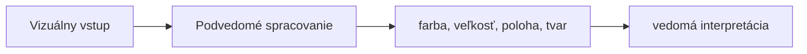

# Gestalt, vnímanie a bullet graf

**Frekvencia/signál:** 4x Gestalt, 3x vnímanie, 1x bullet graf

**Plná téma:** [gestalt vnimanie dashboardy](../topics/gestalt-vnimanie-dashboardy)

## Otázka 1: Gestalt princípy vymenujte, nakreslite a popíšte.

### Intuícia

- Mozog zoskupuje prvky skôr, než nad nimi vedome rozmýšľaš.
- Gestalt pravidlá vysvetľujú, prečo niektoré vizualizácie pôsobia prehľadne.
- Na skúške si priprav malé náčrty: bodky, línie, uzavreté/neúplné tvary.

### Krátka odpoveď

Gestalt princípy opisujú, ako človek automaticky zoskupuje vizuálne prvky do väčších celkov. Na skúške treba pomenovať viac princípov a aspoň niektoré jednoducho nakresliť.

### Čo napísať na skúške

- Blízkosť: blízke prvky vnímame ako skupinu.
- Podobnosť: podobné prvky vnímame spolu.
- Uzavretosť: dopĺňame neúplné tvary.
- Kontinuita: sledujeme plynulé línie.
- Figura/pozadie: oddeľujeme objekt od pozadia.
- Spoločný osud: prvky s rovnakým pohybom patria spolu.

### Diagram / obrázok / kód

### Pozor na pasce

- Nestačí len zoznam; otázka často výslovne chce kresbu.

---

## Otázka 2: Vedomé vs podvedomé vnímanie. Atribúty podvedomého vnímania a uplatnenie vo vizualizácii/dashboardoch.

### Intuícia

- Podvedomé vnímanie zachytí farbu, polohu alebo veľkosť veľmi rýchlo.
- Dashboard má túto rýchlosť využiť na upozornenie na dôležité veci.
- Čím menej šumu, tým ľahšie si človek všimne výnimku.

### Krátka odpoveď

Podvedomé vnímanie rýchlo predspracúva obraz bez vedomej námahy. Vizualizácia ho využíva cez preattentive atribúty, aby používateľ okamžite videl rozdiely, skupiny a výnimky.

### Čo napísať na skúške

- Vedomé: krátkodobá pamäť, rozpoznanie a interpretácia objektov.
- Podvedomé: rýchle obrazové predspracovanie.
- Atribúty: poloha, dĺžka, veľkosť, tvar, orientácia, farba, intenzita, ohraničenie.
- Dashboard: zvýrazniť dôležité hodnoty, zoskupiť súvisiace prvky, nepoužiť zbytočný šum.

### Diagram / obrázok / kód

### Pozor na pasce

- Nepísať len psychológiu; treba povedať dopad na vizualizáciu a dashboard.

---

## Otázka 3: Ako vyzerá bullet graf a čo sa z neho dá vyčítať?

### Intuícia

- Bullet graf je úsporný ukazovateľ výkonu voči cieľu.
- Hlavný pruh je aktuálna hodnota, značka je cieľ.
- Pozadie s pásmami hovorí, či je výsledok slabý, dobrý alebo výborný.

### Krátka odpoveď

Bullet graf je kompaktný jednorozmerný graf, ktorý nahrádza gauge. Ukazuje aktuálnu hodnotu, cieľovú značku a kvalitatívne pásma, napríklad zlé, dobré a výborné.

### Čo napísať na skúške

- Dá sa z neho vyčítať aktuálna hodnota voči cieľu.
- Pásma ukazujú kvalitu výkonu.
- Je úspornejší a čitateľnejší než tachometer.
- Viac bullet grafov sa dá dobre skladať vedľa seba.

### Diagram / obrázok / kód

### Pozor na pasce

- Bullet graf nie je koláčový graf ani tachometer; je lineárny a kompaktný.

