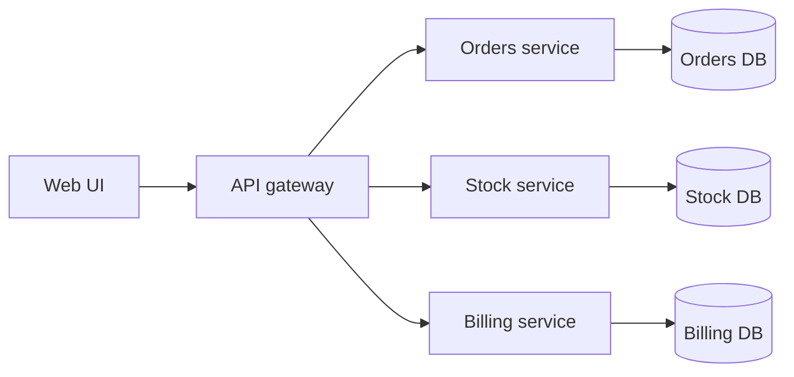
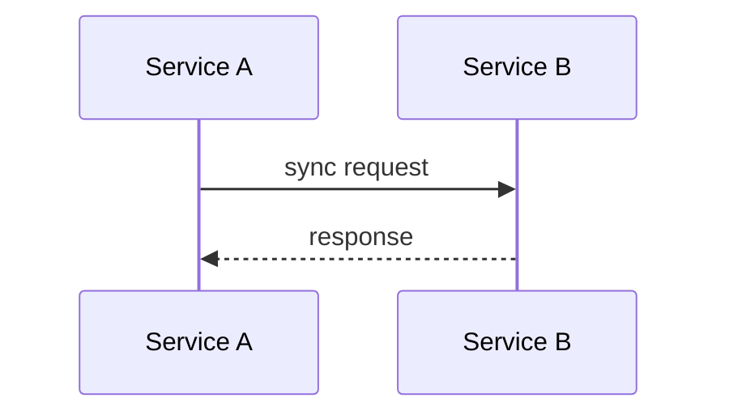
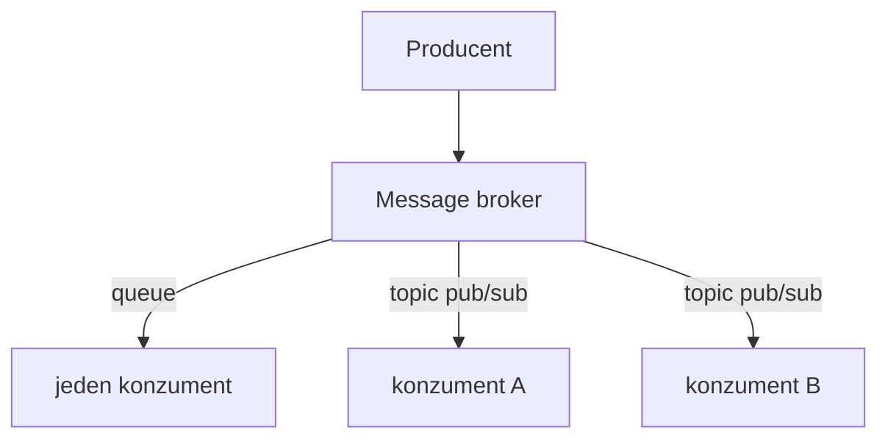

# Mikroslužby a komunikácia

**Frekvencia/signál:** 4x historicky, plus recent mikroslužby signály

**Plná téma:** [mikrosluzby komunikacia](../topics/mikrosluzby-komunikacia)

## Otázka 1: Čo je mikroslužba, aké má vlastnosti a ako sa líši od monolitu?

### Intuícia

- Monolit je jedna veľká nasadzovaná aplikácia.
- Mikroslužba je menší samostatný kus systému s jasným API.
- Výmena jednoduchosti za nezávislé nasadzovanie prináša distribuovanú zložitosť.

### Krátka odpoveď

Mikroslužba je malá samostatná služba s vlastnou business logikou, API, konfiguráciou a často vlastnou databázou. Monolit je jeden nasadzovaný celok so zdieľanou databázou a modulmi v jednej aplikácii.

### Čo napísať na skúške

- Mikroslužba má vonkajšie API, logovanie, health check a externú konfiguráciu.
- Výhody: nezávislé nasadenie, technologická voľnosť, kontinuálny vývoj.
- Nevýhody: sieťová réžia, zložitejšie testovanie, distribuované zlyhania.
- Monolit je jednoduchší na začiatku, ale horšie sa mení po narastení.

### Diagram / obrázok / kód

### Pozor na pasce

- Neuvádzať jednu zdieľanú databázu ako hlavný princíp mikroslužieb.

---

## Otázka 2: Nakreslite príklad IS s webovým rozhraním a mikroslužbami.

### Intuícia

- Kresli tok: Web UI -> API gateway -> samostatné služby.
- Každá služba má vlastnú doménu, často aj vlastnú databázu.
- Cieľ kresby je ukázať oddelenie zodpovedností.

### Krátka odpoveď

Typická kresba má webové UI, API gateway a za ním samostatné služby. Každá služba spravuje vlastnú doménu a ideálne vlastné úložisko.

### Čo napísať na skúške

- Web UI volá API gateway.
- Gateway smeruje požiadavky na konkrétne služby.
- Služby môžu byť napríklad objednávky, sklad, fakturácia a používatelia.
- Každá služba môže mať vlastnú databázu.

### Diagram / obrázok / kód

### Pozor na pasce

- Kresba má ukázať oddelenie služieb, nie len jednu veľkú aplikáciu.

---

## Otázka 3: Ako mikroslužby komunikujú synchrónne a aké sú 3 príklady rozhraní?

### Intuícia

- Synchrónne volanie je ako obyčajné API: zavoláš a čakáš na odpoveď.
- Na skúške vymenuj aspoň tri rozhrania: REST, gRPC, SOAP.
- Nevýhoda je časová previazanosť a timeouty medzi službami.

### Krátka odpoveď

Synchrónna komunikácia je request/response: volajúca služba pošle požiadavku a čaká na odpoveď. Typické aplikačné rozhrania sú REST/HTTP JSON, gRPC a SOAP; v niektorých stackoch aj GraphQL.

### Čo napísať na skúške

- Synchrónne = volajúca služba čaká, kým druhá služba odpovie alebo timeoutne.
- Príklady: REST/HTTP JSON, gRPC, SOAP.
- Nevýhoda sync: časové aj výkonové previazanosti medzi službami.

### Diagram / obrázok / kód

### Pozor na pasce

- Pri sync otázke nestačí povedať len REST; chcú viac príkladov a pointu request/response.

---

## Otázka 4: Aké sú spôsoby asynchrónnej komunikácie a cez čo sú uskutočnené?

### Intuícia

- Asynchrónne znamená, že odosielateľ nečaká na okamžitú odpoveď služby.
- Broker je prostredník, ktorý správy drží alebo distribuuje.
- Queue ide jednému konzumentovi; pub/sub ide viacerým odberateľom.

### Krátka odpoveď

Asynchrónna komunikácia prebieha cez message broker. Pri message queue sa správa doručí jednému konzumentovi. Pri publish/subscribe producent publikuje do témy a správu dostanú všetci odberatelia.

### Čo napísať na skúške

- Queue: RabbitMQ, ActiveMQ, Amazon SQS.
- Publish/subscribe: Kafka, Pulsar, Amazon SNS.
- Výhoda async: služba nemusí čakať na okamžitú odpoveď.
- Nevýhoda async: ťažšie sledovanie, konzistencia a ladenie.

### Diagram / obrázok / kód

### Pozor na pasce

- Pri async otázke treba uviesť broker aj konkrétne technológie.

