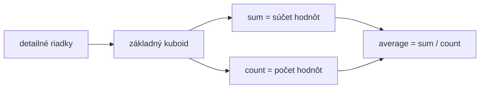

# OLAP kocka a operácie

**Frekvencia/signál:** 8x historicky, plus recent OLAP/kocka signál

**Plná téma:** [olap kocky datovy sklad](../topics/olap-kocky-datovy-sklad)

## Otázka 1: Definujte multidimenzionálnu kocku, dimenzie a aktívne dimenzie.

### Intuícia

- Kocka je tabuľka faktov pozeraná cez viac osí naraz.
- Dimenzie sú osi pohľadu, fakty sú čísla v bunkách.
- Aktívne dimenzie sú tie, podľa ktorých výsledok stále rozlišuješ.

### Krátka odpoveď

Multidimenzionálna kocka mapuje kombináciu hodnôt dimenzií na fakty. Dimenzie určujú súradnice, napríklad čas, produkt a miesto. Aktívne dimenzie sú tie dimenzie, ktoré sú v aktuálnom pohľade ponechané a podľa ktorých sa výsledok ešte člení.

### Čo napísať na skúške

- Dimenzia: usporiadaná množina diskrétnych hodnôt alebo hierarchií.
- Fakt: číselná meraná hodnota v priesečníku dimenzií.
- Základný kuboid obsahuje všetky dimenzie.
- Vrcholový kuboid agreguje cez všetky dimenzie do jedného faktu.

### Diagram / obrázok / kód

### Pozor na pasce

- Kocka nie je len obrázok; je to funkcia z dimenzií do faktov.

---

## Otázka 2: Vysvetlite súčet a aritmetický priemer v OLAP kocke.

### Intuícia

- Súčet sa agreguje priamo, preto je jednoduchý.
- Priemer potrebuje váhu: počet hodnôt v každej skupine.
- Keď priemeruješ priemery bez počtov, výsledok môže byť zlý.

### Krátka odpoveď

Pri súčte sa fakty za rovnaké ponechané súradnice sčítajú cez agregovanú dimenziu. Pri priemere nestačí priemerovať už vypočítané priemery; treba niesť súčet aj počet a výsledok počítať ako súčet / počet.

### Čo napísať na skúške

- Detailné záznamy sa najprv spoja do základného kuboidu.
- Súčet je aditívna agregácia.
- Priemer je neaditívny bez počtu; správne je držať sum a count.
- Pri otázke na počet sa najprv zlučujú rovnaké súradnice a potom sa počíta počet podľa definície faktu.

### Diagram / obrázok / kód

### Pozor na pasce

- Najčastejšia chyba je priemer z priemerov bez váh.

---

## Otázka 3: Definujte roll-up, drill-down, pivot, slice a dice.

### Intuícia

- Tieto operácie nemenia zdrojové dáta, len pohľad na ne.
- Roll-up ide nahor k súhrnu; drill-down ide nadol k detailu.
- Slice/dice filtrujú, pivot otáča zobrazenie dimenzií.

### Krátka odpoveď

Tieto operácie menia pohľad na kocku. Roll-up zvyšuje agregáciu, drill-down zvyšuje detail, pivot mení usporiadanie dimenzií, slice fixuje jednu hodnotu dimenzie a dice filtruje viac dimenzií naraz.

### Čo napísať na skúške

- Roll-up: napríklad deň -> mesiac -> rok.
- Drill-down: napríklad rok -> mesiac -> deň.
- Pivot: otočenie poradia dimenzií v pohľade.
- Slice: región = Praha.
- Dice: región = Praha, čas = Q1, kategória = elektro.

### Diagram / obrázok / kód

### Pozor na pasce

- Slice je jeden rez; dice je viacrozmerný výber.

