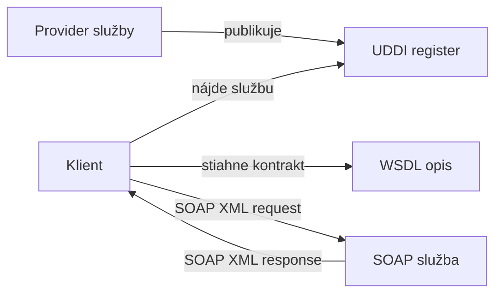

# SOAP, WSDL a UDDI

**Frekvencia/signál:** Recent riadny termín

**Plná téma:** [rest jwt graphql soap](../topics/rest-jwt-graphql-soap)

## Otázka: Web services podľa SOAP. K čomu sú štandardy WSDL a UDDI?

### Intuícia

- SOAP je formálne XML volanie služby.
- WSDL je zmluva, ktorá povie, aké operácie služba ponúka.
- UDDI je katalóg, kde sa služby dajú nájsť.

### Krátka odpoveď

SOAP je štandardizovaný protokol webových služieb založený na XML správach. WSDL je formálny opis služby a jej operácií. UDDI je register, v ktorom sa služby dajú publikovať a vyhľadávať.

### Čo napísať na skúške

- SOAP správa má Envelope, voliteľný Header a Body.
- WSDL opisuje operácie, vstupy, výstupy, dátové typy a endpoint.
- Z WSDL sa dajú generovať stuby alebo serverové rozhrania.
- UDDI slúži ako katalóg/register služieb.

### Diagram / obrázok / kód



```xml
<env:Envelope>
  <env:Header />
  <env:Body>
    <!-- volanie operácie -->
  </env:Body>
</env:Envelope>
```

### Pozor na pasce

- WSDL nie je samotné volanie; je to kontrakt služby.
- SOAP je striktnejší a XML-heavy oproti RESTu.

