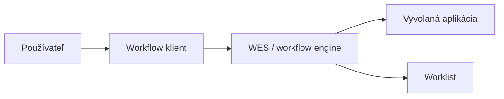
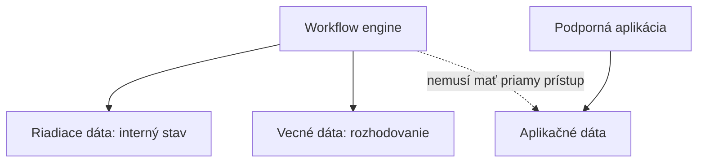
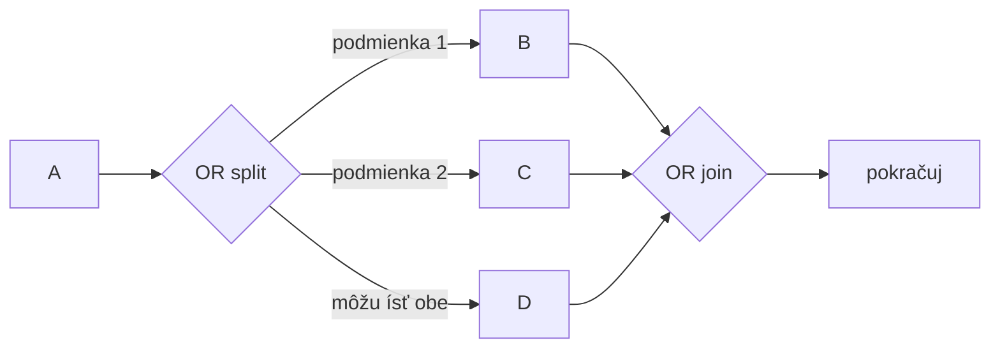

# Workflow dáta, aplikácie a brány

**Frekvencia/signál:** 2x dáta/aplikácie, 1x AND/XOR, recent AND/OR split/join

**Plná téma:** [workflow a wfmc](../topics/workflow-a-wfmc)

## Otázka 1: Popíšte klientske a vyvolané aplikácie vo workflow.

### Intuícia

- Klient je miesto, kde človek vidí a rieši svoju prácu.
- Vyvolaná aplikácia je nástroj, ktorý workflow spustí, aby sa práca dala dokončiť.
- Rozdiel je používateľské rozhranie vs podporný vykonávací nástroj.

### Krátka odpoveď

Klientske aplikácie sú rozhrania, cez ktoré používatelia vykonávajú úlohy. Vyvolané aplikácie sú programy alebo služby, ktoré workflow systém spustí pri začatí alebo vykonávaní úlohy.

### Čo napísať na skúške

- Klient workflow = interakcia používateľa s worklistom a úlohami.
- Vyvolaná aplikácia = automaticky alebo poloautomaticky spustený nástroj.
- Príklady vyvolaných aplikácií: účtovnícky systém, Word, interná služba, externé API.

### Diagram / obrázok / kód

### Pozor na pasce

- Klient je používateľské rozhranie; vyvolaná aplikácia robí podporujúcu prácu.

---

## Otázka 2: Popíšte aplikačné, vecné a riadiace dáta vo workflow.

### Intuícia

- Riadiace dáta patria enginu a hovoria, kde sa proces nachádza.
- Vecné dáta ovplyvňujú rozhodnutia v procese.
- Aplikačné dáta patria konkrétnym aplikáciám a workflow ich nemusí priamo spravovať.

### Krátka odpoveď

Riadiace dáta sú interné dáta workflow systému. Vecné dáta používa workflow jadro na rozhodovanie o ďalšom postupe. Aplikačné dáta patria konkrétnym podporným aplikáciám a workflow systém ich nemusí priamo čítať.

### Čo napísať na skúške

- Riadiace dáta: stav procesu, interné údaje enginu, obnova po havárii.
- Vecné dáta: hodnoty používané v rozhodovacích pravidlách a smerovaní.
- Aplikačné dáta: špecifické dáta aplikácií mimo priamej kontroly workflow jadra.

### Diagram / obrázok / kód

### Pozor na pasce

- Vecné dáta nie sú to isté ako aplikačné dáta.
- Riadiace dáta sú interné a bežné aplikácie ich nemajú používať.

---

## Otázka 3: Nakreslite a popíšte AND-split, AND-join, XOR-split, XOR-merge, prípadne OR-split.

### Intuícia

- AND = všetko naraz alebo čakanie na všetko.
- XOR = práve jedna alternatíva.
- OR = jedna alebo viac aktívnych vetiev; join čaká len na tie spustené.

### Krátka odpoveď

AND znamená paralelné spustenie alebo synchronizáciu všetkých vetiev. XOR znamená výber práve jednej vetvy alebo jednoduché spojenie alternatív. OR aktivuje jednu alebo viac vetiev podľa podmienok.

### Čo napísať na skúške

- AND-split: rozdelí tok na viac paralelných vetiev.
- AND-join: čaká, kým skončia všetky predchádzajúce vetvy.
- XOR-split: podľa podmienky pustí práve jednu vetvu.
- XOR-merge: spojí alternatívne vetvy; nečaká na neaktívne vetvy.
- OR-split: aktivuje jednu alebo viac vetiev.
- OR-join: čaká len na tie vetvy, ktoré boli reálne aktivované.

### Diagram / obrázok / kód

### Pozor na pasce

- AND-join čaká na všetky vetvy.
- XOR-split vyberá práve jednu vetvu.
- OR-split nie je XOR; môže aktivovať viac vetiev.

