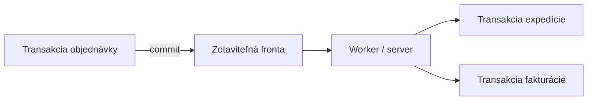
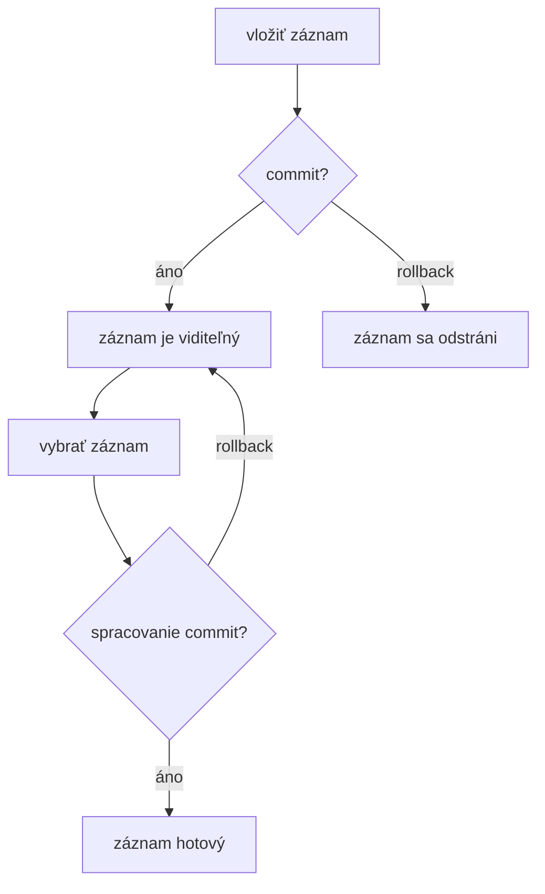
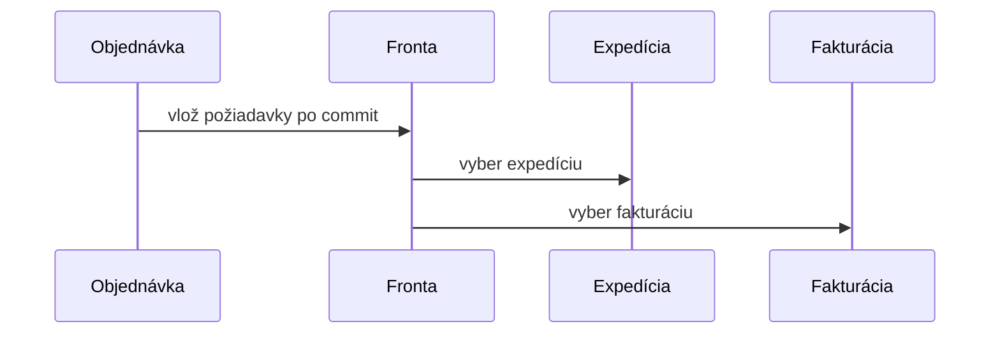

# Zotaviteľná fronta

**Frekvencia/signál:** 6x historicky, plus recent fronta otázka

**Plná téma:** [zotavitelne fronty transakcie](../topics/zotavitelne-fronty-transakcie)

## Otázka 1: Definujte zotaviteľnú frontu, princíp a súvislosť s transakciami.

### Intuícia

- Je to fronta práce, ktorá nesmie zmiznúť po páde systému.
- Práca sa má spustiť až vtedy, keď predchádzajúca transakcia naozaj prešla.
- Pointa je trvanlivosť a prepojenie s commit/rollback.

### Krátka odpoveď

Zotaviteľná fronta je trvanlivý mechanizmus na naplánovanie práce do budúcnosti. Je koordinovaná s transakciami tak, aby naplánovaná práca nezmizla pri havárii a aby rollback správne vrátil stav fronty.

### Čo napísať na skúške

- Fronta musí prežiť haváriu systému.
- Vloženie a výber z fronty sú súčasťou transakčnej logiky.
- Používa sa, keď sa práca má vykonať až po úspešnom dokončení inej transakcie.

### Diagram / obrázok / kód

### Pozor na pasce

- Hlavná vlastnosť nie je FIFO, ale trvanlivosť a transakčná koordinácia.

---

## Otázka 2: Popíšte operácie, vlastnosti a rollback pravidlá zotaviteľnej fronty.

### Intuícia

- Vloženie do fronty je len návrh, kým transakcia necommitne.
- Vybraná položka nie je definitívne preč, kým spracovanie necommitne.
- Rollback musí vrátiť frontu do konzistentného stavu.

### Krátka odpoveď

Základné operácie sú vlož a vyber. Vlož naplánuje záznam o práci spolu s parametrami. Vyber záznam odoberie pre transakciu, ktorá prácu vykoná. Pri rollbacku sa musí obnoviť aj stav fronty.

### Čo napísať na skúške

- Vložený záznam sa stane dostupný až po commite vkladajúcej transakcie.
- Ak sa vkladajúca transakcia zruší, záznam z fronty zmizne.
- Ak transakcia záznam vyberie a potom rollbackne, záznam sa musí vrátiť.
- Záznam obsahuje akciu a dáta, napríklad ID objednávky.

### Diagram / obrázok / kód

### Pozor na pasce

- Necommitnuté záznamy nesmie vyberať iná transakcia.

---

## Otázka 3: Ukážte použitie zotaviteľnej fronty na jednoduchom príklade.

### Intuícia

- Objednávka je dobrý príklad: po commite sa má spustiť ďalšia práca.
- Expedícia a fakturácia môžu bežať neskôr a oddelene.
- Fronta drží záväzok, že sa tá práca nestratí.

### Krátka odpoveď

Pri objednávke sa po úspešnom commite vložia do fronty požiadavky na expedíciu a fakturáciu. Aj keď systém spadne hneď po objednávke, fronta prežije a worker neskôr požiadavky spracuje.

### Čo napísať na skúške

- Objednávka je prvá transakcia.
- Expedícia a fakturácia môžu byť samostatné neskoršie transakcie.
- Požiadavka sa nesmie stratiť ani vykonať nekonzistentne.

### Diagram / obrázok / kód

### Pozor na pasce

- Neopisovať to ako jeden dlhý rollback; po commite sa ide dopredu cez ďalšie transakcie.

