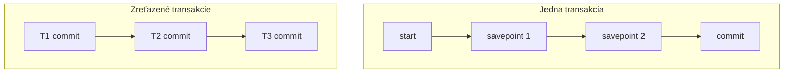
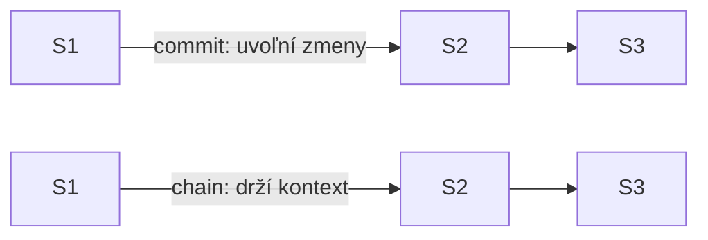

# Zreťazené transakcie vs savepointy

**Frekvencia/signál:** 2x historicky, plus recent commit()/chain() otázka

**Plná téma:** [zotavitelne fronty transakcie](../topics/zotavitelne-fronty-transakcie)

## Otázka 1: Porovnajte zreťazené transakcie so savepointmi.

### Intuícia

- Savepoint je bod návratu v jednej transakcii.
- Zreťazenie je séria menších transakcií s vlastnými commitmi.
- Zreťazenie pomáha výkonu, ale oslabuje atomicitu celého dlhého procesu.

### Krátka odpoveď

Savepointy sú body návratu v jednej transakcii. Zreťazené transakcie delia dlhý proces na viac samostatných podtransakcií, ktoré sa postupne commitujú.

### Čo napísať na skúške

- Savepoint rollback vracia DB do uloženého bodu, ale lokálne premenné môžu zostať.
- Pri zreťazení po commite už danú podtransakciu bežným rollbackom nevrátime.
- Zreťazenie zlepšuje výkon a skracuje zámky, ale oslabuje atomicitu celku.

### Diagram / obrázok / kód

### Pozor na pasce

- Zreťazený proces ako celok nie je jedna plne atomická ACID transakcia.

---

## Otázka 2: Commit() vs chain(): sú dielčie transakcie a celá transakcia atomické a izolované?

### Intuícia

- Dielčie kroky môžu byť samostatne ACID.
- Celok po priebežných commitoch už nie je jedna vratná transakcia.
- chain() drží kontext dlhšie, takže izolácia je lepšia, ale systém platí výkonom.

### Krátka odpoveď

Jednotlivé podtransakcie sú transakcie, takže lokálne môžu byť atomické a izolované. Celý zreťazený proces však pri commit() nie je atomický a izolácia celku sa zhorší, ak sa medzi krokmi uvoľní DB kontext. chain() drží kontext dlhšie a tým zlepšuje izoláciu, ale znižuje výkon.

### Čo napísať na skúške

- commit(): zmeny sú potvrdené a môžu byť viditeľné iným transakciám.
- chain(): pokračuje sa ďalšou transakciou bez plného uvoľnenia kontextu.
- Atomicita celku: nie, po čiastočnom commite treba roll-forward alebo kompenzáciu.
- Izolácia celku: pri commit() oslabená, pri chain() lepšia, ale drahšia.

### Diagram / obrázok / kód

### Pozor na pasce

- Ak sa stane fyzická akcia bez rollbacku, rieši sa dopredne alebo kompenzačne.

