# Past Questions

Táto stránka je transformovaný zdrojový súbor. Base64 obrázky boli vyextrahované do `assets/images`, aby ich Quartz normálne renderoval.

**PIS**

Príprava na semestrálnu skúšku 2022/2023

**Dôležité informácie o semestrálnej skúške povedané na prednáške:**

Riadny termín:

**17.05.2023 13:00 - 14:50 – D105**

1\. opravný termín:

**31.05.2023 11:00 - 12:50 – učebňa D0206**

2\. opravný termín:

**08.06.2023 11:00 - 12:50 – učebňa E104**

Výskyt otázok:

[15x WF – 8x  Definujte pojmy proces, uloha, pripad, zdroj, pracovna polozka, aktivita. Uvedte ako spolu suvisia.](#15x-wf-–-8x-definujte-pojmy-proces,-uloha,-pripad,-zdroj,-pracovna-polozka,-aktivita.-uvedte-ako-spolu-suvisia.)

[15x WF - 4x - Schema referencneho modelu. Nakreslit schemu, popisat prvky a rozhrania (strucne).](#15x-wf---4x---schema-referencneho-modelu.-nakreslit-schemu,-popisat-prvky-a-rozhrania-(strucne).)

[15x WF - 2xPopiste klientske a vyvolane aplikacie vo WF. Popiste aplikacne, vecne, riadace data vo WF.](#15x-wf---2x-popiste-klientske-a-vyvolane-aplikacie-vo-wf.-popiste-aplikacne,-vecne,-riadace-data-vo-wf.)

[15x WF - 1x  Nakreslete a popište co dělají jednotlivé prvky řízení toku ve workflow: AND-split, AND-join, XOR-split, XOR-merge](#15x-wf---1x-nakreslete-a-popište-co-dělají-jednotlivé-prvky-řízení-toku-ve-workflow:-and-split,-and-join,-xor-split,-xor-merge)

[8x Multidimenzionalna kocka pre priemer, sucet. Definicia kocky, ar. priemeru. roll-up, drill-down, pivot, slice&dice.](#8x-multidimenzionalna-kocka-pre-priemer,-sucet.-definicia-kocky,-ar.-priemeru.-roll-up,-drill-down,-pivot,-slice&dice.)

[6x Zotavitelna fronta. Definicia, princip, suvislost s transakciami. Popisat jej vlastnosti a operacie. Ukazat pouzitie na jednoduchom priklade.](#6x-zotavitelna-fronta.-definicia,-princip,-suvislost-s-transakciami.-popisat-jej-vlastnosti-a-operacie.-ukazat-pouzitie-na-jednoduchom-priklade.)

[4x Architektura IS sestávající z mikroslužeb, co to je mikrosluzba a jeji vlastnosti, porovnat s monolitickou architekturou a nakreslit priklad IS s webovym rozhrani a mikrosluzbami.](#4x-architektura-is-sestávající-z-mikroslužeb,-co-to-je-mikrosluzba-a-jeji-vlastnosti,-porovnat-s-monolitickou-architekturou-a-nakreslit-priklad-is-s-webovym-rozhrani-a-mikrosluzbami.)

[4x GraphQL Co to je? V com sa lisi od REST? Popisat vlastnosti a datovy model (datove typy). Co treba definovat na klientskej a serverovej strane aby sme ho mohli pouzit?](#4x-graphql-co-to-je?-v-com-sa-lisi-od-rest?-popisat-vlastnosti-a-datovy-model-(datove-typy).-co-treba-definovat-na-klientskej-a-serverovej-strane-aby-sme-ho-mohli-pouzit?)

[4x Gestalt principy, vyjmenovat a nakreslit a popsat (7b)](#4x-gestalt-principy,-vyjmenovat-a-nakreslit-a-popsat-(7b))

[3x OLAP charakteristika, ROLAP, jak se ukládá do relační DB - schémata hvězda a vločka popsat.](#3x-olap-charakteristika,-rolap,-jak-se-ukládá-do-relační-db---schémata-hvězda-a-vločka-popsat.)

[3x Canvas a SVG, popsat, uvest jak se vztahuji k DOM a pro vykresleni diagramu.](#3x-canvas-a-svg,-popsat,-uvest-jak-se-vztahuji-k-dom-a-pro-vykresleni-diagramu.)

[3x Vedome vs. podvedome vnimanie. Atributy podvedomeho vnimania. Ako sa podvedome vnimanie uplatni vo vizualizacii? Ako sa podvedome vnimanie uplatni v dashboardech?](#3x-vedome-vs.-podvedome-vnimanie.-atributy-podvedomeho-vnimania.-ako-sa-podvedome-vnimanie-uplatni-vo-vizualizacii?-ako-sa-podvedome-vnimanie-uplatni-v-dashboardech?)

[2x D3.js popsat, co ma na vstupu/vystupu. Uveden seznam items = \[15,312,24124...\] a bylo potreba napsat prikaz ktery ziska nejaky seznam a nahradi jeho hodnoty s hodnotami v seznamu items.](#2x-d3.js-popsat,-co-ma-na-vstupu/vystupu.-uveden-seznam-items-=-[15,312,24124...]-a-bylo-potreba-napsat-prikaz-ktery-ziska-nejaky-seznam-a-nahradi-jeho-hodnoty-s-hodnotami-v-seznamu-items.)

[2x Autentizacia v RESTe. Preco nie je mozne pouzit sessions? Uvedte mechanizmy autentizacie pre REST. Popiste JSON Web Token, co to je, z coho sa sklada a ako prebieha autentizacia pomocou JWT.](#2x-autentizacia-v-reste.-preco-nie-je-mozne-pouzit-sessions?-uvedte-mechanizmy-autentizacie-pre-rest.-popiste-json-web-token,-co-to-je,-z-coho-sa-sklada-a-ako-prebieha-autentizacia-pomocou-jwt.)

[2x CDI - Popiste CDI, ako sa definuju CDI objekty, kto ich vytvara. Popiste pojem scope v tomto kontexte, vysvetlite request, session, application scope.](#2x-cdi---popiste-cdi,-ako-sa-definuju-cdi-objekty,-kto-ich-vytvara.-popiste-pojem-scope-v-tomto-kontexte,-vysvetlite-request,-session,-application-scope.)

[2x Sekvencni a hierachicke procesy a nakreslit v UML](#2x-sekvencni-a-hierachicke-procesy-a-nakreslit-v-uml)

[2x Zretazene procesy vs Savepointy](#2x-zretazene-procesy-vs-savepointy)

[1x Typy geografickych grafu / vizualizace geografických dat, co je GeoJSON a použití](#1x-typy-geografickych-grafu-/-vizualizace-geografických-dat,-co-je-geojson-a-použití)

[1x dedicnost v objektovem modelu. definice jednoduche a vicenasobne dedicnosti + jejich grafy.](#1x-dedicnost-v-objektovem-modelu.-definice-jednoduche-a-vicenasobne-dedicnosti-+-jejich-grafy.)

[1x Datový sklad - schéma, datový model, jak se liší od OLTP](#1x-datový-sklad---schéma,-datový-model,-jak-se-liší-od-oltp)

[1x Jak vypadá Bullet graf, co z něj lze vyčíst](#1x-jak-vypadá-bullet-graf,-co-z-něj-lze-vyčíst)

[1x Vícetypovost - k čemu je potřeba, jaký je s ní spojen problém, jak se řeší, uvést příklad](#1x-vícetypovost---k-čemu-je-potřeba,-jaký-je-s-ní-spojen-problém,-jak-se-řeší,-uvést-příklad)

[TODO - 1x , definovat multidimenzionalni kostku, nakreslit 4D kostku pro time, item, location, supplier. Popísať kostku pro počet.](#todo---1x-,-definovat-multidimenzionalni-kostku,-nakreslit-4d-kostku-pro-time,-item,-location,-supplier.-popísať-kostku-pro-počet.)

 

###### 15x WF – 8x  Definujte pojmy proces, uloha, pripad, zdroj, pracovna polozka, aktivita. Uvedte ako spolu suvisia. 

• proces

• koordinační mechanismus napříč organizačními jednotkami distribuovaný v čase a prostoru

• integruje a koordinuje distribuované zdroje a poskytuje správnou informaci správnému jednotlivci ve správný čas k vykonání přiděleného úkolu

• případ (case)

• konkrétní řešený problém (žádost o půjčku)

• úloha (task) 

• krok provádění procesu

• zdroj (resource) 

• zařízení (fax, tiskárna) nebo osoba (účastník, dělník, zaměstnanec)

• pracovní položka, požadavek (work item)   
• úkol řešený pro konkrétní případ, např. „vrátit panu Novákovi peníze za reklamované zboží“

• činnost (activity)   
• úkol řešený pro konkrétní případ a využívající konkrétní zdroj   
• vytváří frontu požadavků (worklist)

 

Jak to spolu souvisí? - Určují nám pohled na workflow a taky jej reprezentují.  
****

###### 15x WF - 4x - Schema referencneho modelu. Nakreslit schemu, popisat prvky a rozhrania (strucne). 

  

 

**WES (workflow enactment service)**:

* Zajišťuje vykonání správné činnosti pomocí správného prostředku ve správný čas  
* Sklada se z jednoho nebo více workflow engines

**Workflow engine**:

* Interpretace definice procesu  
* Vytváří instance procesů a řídí jejich vykonávání  
* Zajišťuje přechody mezi aktivitami a vytváření pracovních položek

**Klientské aplikace workflow**:

* Provádí jednotlivé úkoly  
* Interakce uživatelů s workflow

**Vyvolané aplikace**:

* Spouštěné v souvislosti se započetím úkolu apod.

**Nástroje pro definici procesů**:

* Umožňují definici a rozplánování procesů na počítači

 

**ROZHRANÍ**

1. Pro nástroje pro definici procesů   
2. Pro workflow klienty   
3. Pro volané aplikace   
4. Pro komunikaci s jinými WFM systémy  
5. Pro administraci a monitorování

Data WF: 

• Model organizační struktury – Role, vztahy nadřízený – podřízený 

• Definice procesu – Činnosti, přidělení rolím, rozhodovací pravidla 

• Seznam úkolů – Aktuální úkoly pro konkrétní uživatele – Uživateli buď skryt (postupné přidělování úkolů) nebo přístupný (uživatel si volí pořadí, možno i více úkolů současně) 

• Řídicí data workflow – Interní data WF systému nutná pro zajištění chodu příp. zotavení po havárii – Nedostupná externím aplikacím 

• Věcná data workflow – Zpracování jádrem workflow systému – Používána pro rozhodování o dalším postupu – Dostupná i aplikacím 

• Aplikační data workflow – Specifická data aplikací podporujících proces – Nejsou přístupná WF systému 

###### 15x WF - 2x Popiste klientske a vyvolane aplikacie vo WF. Popiste aplikacne, vecne, riadace data vo WF. 

Procedurální automatizace business procesu prostřednictvím správy sekvence pracovních aktivit a vyvolání příslušných lidských nebo IT zdrojů příslušejících k těmto aktivitám.

**Klientské aplikace workflow**:

* Provádí jednotlivé úkoly  
* Interakce uživatelů s workflow

**Vyvolané aplikace**:

* Spouštěné v souvislosti se započetím úkolu - automatizovane apod.  
* Su to aplikace 3tich stran. Word, Učtovnicka aplikace apod.

• Řídicí data workflow – Interní data WF systému nutná pro zajištění chodu příp. zotavení po havárii – Nedostupná externím aplikacím 

• Věcná data workflow – Zpracování jádrem workflow systému – Používána pro rozhodování o dalším postupu – Dostupná i aplikacím 

• Aplikační data workflow – Specifická data aplikací podporujících proces – Nejsou přístupná WF systému 

###### 15x WF - 1x  Nakreslete a popište co dělají jednotlivé prvky řízení toku ve workflow: AND-split, AND-join, XOR-split, XOR-merge 

**Parallel split (AND - split)** 

*  Rozděluje tok procesů (workflow) do dvou a více paralelních vláken

**Synchronizace (AND - join)** 

* Dalším úkolem se pokračuje, až po dokončení  všech předchozích vláken.

  
**Výlučné rozhodnutí (XOR - split)**

* Rozděluje tok procesů na dvě nebo více větví,  které jsou vzájemně výlučné. Podle podmínky v Gateway se vstupuje do jedné z větví.

**Jednoduché spojení (XOR - merge)**

* Spojení dvou nebo více nezávislých větví do  jedné. Navazující aktivita začne okamžitě, jakmile jedno vlákno dosáhne svého konce.

###### 8x Multidimenzionalna kocka pre priemer, sucet. Definicia kocky, ar. priemeru. roll-up, drill-down, pivot, slice&dice. 

* Dimenze je uspořádatelná množina hodnot diskrétního základního typu (integer, výčet, čas) nebo množina jejich struktur hierarchicky organizovaných  
     
  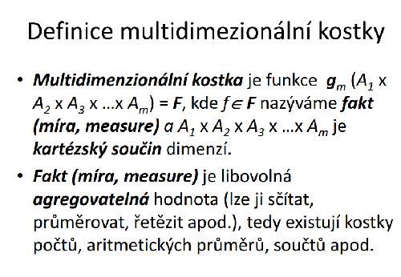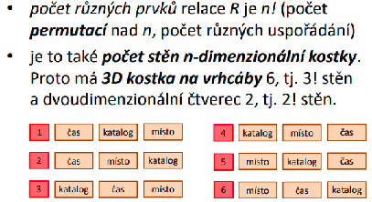  
    
  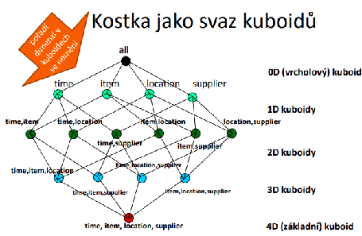

Typicky se tvoří více dotazů po sobě (podle toho co manažer chce), proto OLAP systém umožňuje následující operace s kostkou:

- **roll-up** - vzrůst úrovně agregace = snížení detailu (takže uberu nějakou dimenzi)  
  - např. manažera nezajímá cena, tak tuto dimenzi ubere  
- **drill-down** - snížení úrovně agregace = zvýšení detailu (přidám dimenzi)  
  - např. manažer chce výsledný model agregovat podle jednotlivých produktů, tak přidá dimenzi produkt  
- **pivoting** - změna uspořádání dimenzí (to znamená že vznikne trochu jinak členěná výsledná kostka)  
  - např. manažer změní model tak, že nejprve agreguje podle času a až potom podle místa  
- **slicing & dicing** - výběr projekce (změna skutečné kardinality 1 nebo více dimenzí)   
  - např. manažer chce více rozšířit agregaci podle času - zanoří se v čase a bude agregovat podle dnů, nikoliv podle měsíců 

######  6x Zotavitelna fronta. Definicia, princip, suvislost s transakciami. Popisat jej vlastnosti a operacie. Ukazat pouzitie na jednoduchom priklade. 

Mechanismus na plánování transakcí pro budoucí vykonání a zajištění, že **vykonání bylo skutečně v aplikaci provedeno a jenom jednou**.

**Operace**  
**Vlož**: transakce vkládá do fronty záznam o práci naplánované k provedení i s jeji parametry, právě když je transakce potvrzena  
**Vyber**: Záznam je později vyzvednut jinou transakcí, která danou práci provede. Tato transakce bývá typicky spuštěna serverem, který periodicky kontroluje frontu a vybírá z ní pracovní požadavky  
**Vkládaný/vybíraný záznam**: obsahuje informaci o akci, která je plánována a o datech, která je potřeba mezi jednotlivými transakcemi v řetězu předávat (např. ID objednávky)

Zotavitelná fronta musí být **trvanlivá** - pro případ havárie systému.  
Realizováno např. prostřednictvím tabulky v DB ; lepší je však využití oddělený aplikační modul

Atomicita transakce vyžaduje od vložení/výběru z fronty tuto koordinaci s potvrzením transakce:

* Vloží-li transakce do fronty záznam a později je zrušena, tak musí být tento záznam z fronty odstraněn  
* Vybere-li transakce z fronty záznam a později je zrušena, tak musí být tento záznam do fronty vrácen  
* Dokud není transakce T potvrzena, tak nelze jinými transakcemi vybírat záznamy, které byly transakcí T vloženy, protože transakce T může být ještě zrušena 

**Příklad:**

Systém se skládá ze tří hlavních částí – objednávky, expedice, fakturace. Úkoly lze vykonat třemi oddělenými transakcemi. Jediný požadavek je, aby **fakturace a expedice byla provedena kdykoliv po úspěšném dokončení objednávky**, a to i v případě havárie systému ihned po objednání.

###### 4x Architektura IS sestávající z mikroslužeb, co to je mikrosluzba a jeji vlastnosti, porovnat s monolitickou architekturou a nakreslit priklad IS s webovym rozhrani a mikrosluzbami. 

 

**Mikroslužby**

Aplikace je rozdělena na malé části. Typicky vlastní databáze (nepřístupná vně systému), komunikace mezi jednotlivými částmi. Spojovacim bodem je pouze API gateaway. Typicky malý tým vývojářů na každou část (2 pizzas rule). 

**Výhody** - technologická nezávislost = rôzne vývojové prostredie, snadné aktualizace = aktualizuje sa iba jedna mikroslužba z veľkého celku, kontinuální vývoj

**Nevýhody** - špatná testovatelnost (závislosti na dalších službách) - hrubé testy je možné spustiť lokálne, ostatnú funkcionalitu až v reálnom provoze, režie komunikace = formulace, dekodovani správy, možné řetězové selhání, riziko nekompatibility

**Vlastnosti mikroslužby** - disponuje vnějším API, externí konfigurace, logování, vzdálené sledování (telemetrie, *health check*)

 

**Monolitická architektura**

Jedna aplikace - Jedna databáze, webové (aplikační) rozhraní, Business moduly – např. objednávky, doprava, sklad, …

**Výhody** - Jednotná technologie, sdílený popis dat, testovatelnost, rychlé nasazení (jeden balík)

**Nevýhody** - Rozměry aplikace mohou přerůst únosnou mez, neumožňuje rychlé aktualizace částí, reakce na problémy, pokud použité technologie zastarají, přepsání je téměř nemožné

 

**Příklad mikroslužby (Uber):**  
**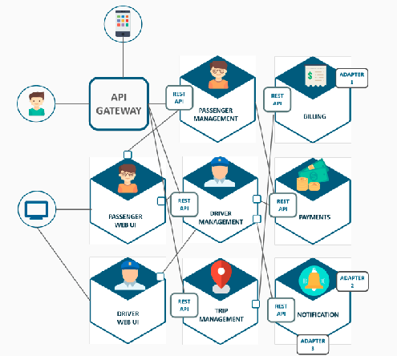**

###### 4x GraphQL Co to je? V com sa lisi od REST? Popisat vlastnosti a datovy model (datove typy). Co treba definovat na klientskej a serverovej strane aby sme ho mohli pouzit? 

K čemu to je:  
V DB mám informace o osobě (jméno, příjmení, email, adresa, …). Přijdu na nějakou stránku, která má zobrazovat informace o osobě, ale jen některé. A tady přichází na řadu GraphQL, které umožní v dotazu specifikovat, které informace chci vrátit (např. pouze jméno a příjmení).  
GrapqQL je dotazovací jazyk umožňující efektivnější přístup při tvorbě API. Pracuje na úrovni aplikační vrstvy, je silně typované. Dotaz na API specifikuje požadovaný tvar odpovědi. Oproti REST snižuje počet dotazů, objem přenášených dat a jejich redundanci. Také není třeba používat složitější logiku na klientovi (ve stylu mám 4 dotazy, 3 projdou v pohodě a poslední selže – co teď? ; GraphQL prostě jeden dotaz a ok/not ok).

| GraphQL | REST |
| :---- | :---- |
| Jeden endpoint | Mnoho endpointů |
| Vrací jen klientem specifikovaná data | Vrací “všechna” data |
| Nezávislé na protokolu | HTTP protokol |

Datový model:  
Jazyk pro popis: GraphQL SDL (schema definition language)  
Jednoduché typy: int, string, boolean, …  
Uživatelské typy (struktury): osoba, auto, …  
Speciální typy reprezentující volání API:

*  Query – pro čtení dat  
*  Mutations – pro změnu dat

Ukázka (Závorky -\> kolekce, \! -\> not null):  
type Person {  
        	name: String\!,  
        	age: Int\!,  
        	cars: \[car\!\]\!  
}  
type Query {  
        	findPerson(name: String\!): Person\!  
}  
type Mutations {  
        	CreatePerson(name: String\!, age: Int\!): Person\!  
}  
Cca takový popis je potřeba připravit na serveru, když chci publikovat GraphQL API.  
Klient zas musí specifikovat jaká data chce.  
findPerson (name: „James“) {  
        	age  
}  
Ukázka s HTTP:  
GET: [http://myapi.com/graphql?query={me{name](http://myapi/graphql?query=%7Bme%7Bname)}}  
POST: Specifikovat Data application/graphql a pak jen {me{name}}

###### 4x Gestalt principy, vyjmenovat a nakreslit a popsat (7b) 

**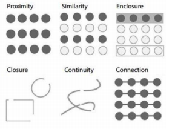**  
**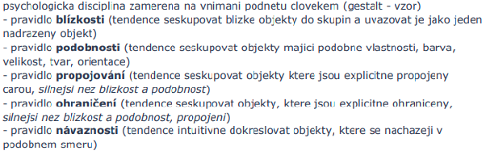**

- pravidlo uzavreni, zavirat prvky do chlivecku, tvaru..

###### 3x OLAP charakteristika, ROLAP, jak se ukládá do relační DB - schémata hvězda a vločka popsat. 

**OLAP**  
online analytics processing. Je to system pro podporu rozhodovani pro podnikani (podpora Business Inteligence). OLAP zahrnuje v sebe procesy, technologie, a nastroje potrebne k pretvoreni dat a informaci do znalosti pro podporu rozhodovani na ruznych urovnich.

Architektury serveru OLAP: MOLAP, ROLAP, HOLAP, specialozovaný SQL server 

 

**Relační OLAP (ROLAP)**

* užívá relační nebo rozšířená relační SŘBD  
* údaje jsou získávány z relačních tabulek, jsou uživateli předkládány jako multidimenzionální pohled  
* data jsou uložena jako záznamy relační tabulky  
* žádná redundance

\_\_\_\_\_\_\_\_\_\_\_\_\_\_\_\_\_\_\_\_\_\_\_\_\_\_\_\_\_\_\_\_\_\_\_\_\_\_\_\_\_\_\_\_\_\_\_\_\_\_\_\_\_\_\_\_\_\_\_\_\_\_\_\_\_\_\_\_\_\_\_\_\_\_\_\_\_\_\_\_\_\_\_\_\_\_

* zahrnují optimalizaci BE, implementaci agregační navigační logiky a dodatečných pomůcek/služeb  
* velká možnost škálování

 

**Hvězda**

jedna tabulka faktů je ve středu připojena k množině relací dimenzí

 

**Vločka**

poskytuje zjemnění schématu hvězdy tak, že hierarchie dimenzí je explicitně reprezentována normalizováním relací dimenzí 

###### 3x Canvas a SVG, popsat, uvest jak se vztahuji k DOM a pro vykresleni diagramu. 

**Canvas**  
umožňuje renderovat grafické prvky ve formě rastrové grafiky  
vhodné pro náročnější grafiku nebo při tvorbě her  
\<canvas\> je obdélníková oblast určující:

* výšku  
* šířku  
* identifikátor v rámci dokumentu (id)

Prvky nejsou reprezentovány v DOM (=\> obtížnější přístup, manipulace, provázání s uživatelskými eventy)  
Pro tvorbu diagramů je lepší SVG  
Pro úpravu obsahu je potřeba použít Canvas API  
Metody pro kreslení poskytuje objekt získaný metodou getContext()  
   
**SVG**  
značkovací jazyk rodiny XML pro popis vektorové grafiky  
není vhodné pro náročnější grafiku  
\<svg\> je obdélníková oblast určující:

* šířku  
* výšku  
* v těle popis vektorových elementů  
* případně identifikátor v rámci dokumentu (id)

Lze vložit přímo do HTML =\> Prvky jsou reprezentovány v DOM  
Nutnost dynamicky generovat svg elementy na základě dat  
Elementům je možné nastavit handlery událostí (onclick, mouseover, ...)  
Základní elementy: \<rect\>, \<circle\>, \<line\>, \<path\>, ...  
Styly lze nastavit buď inline nebo za použití externího CSS - fill, stroke, ...

###### 3x Vedome vs. podvedome vnimanie. Atributy podvedomeho vnimania. Ako sa podvedome vnimanie uplatni vo vizualizacii? Ako sa podvedome vnimanie uplatni v dashboardech? 

**Vědomé**: krátkodobá část paměti, zpracování rozpoznaných objektů (přiřazení významu)  
**Podvědomé**: obrazová část paměti, předzpracování obrazu 

**Atributy** podvědomého vnímání:  
orientace, délka, šířka, velikost, tvar, ohraničení, výplň, odstín, barevná intenzita, 2D pozice, …

**Uplatnenie podvedomého vnímania -** človek má tendenciu zjednodušovať a zhlukovať prvky používateľského rozhrania do väčších celkov, čím sa zrýchľuje jeho vizuálne vnímanie  
**Uplatnenie v dashboards -** pri dodržiavaní pravidiel vyplývajúcich z atribútov podvedomého vnímania (napr. pravidlo jednoduchosti, pravidlo blízkosti, pravidlo podobnosti) bude výsledný dashboard intuitívnejší a pre používateľa príjemnejší

###### 2x D3.js popsat, co ma na vstupu/vystupu. Uveden seznam items = \[15,312,24124...\] a bylo potreba napsat prikaz ktery ziska nejaky seznam a nahradi jeho hodnoty s hodnotami v seznamu items. 

D3.js - knihovna jazyka Javascript určená pro manipulaci s dokumenty na základě dat  
**Vstup:** data (csv, json, xml, …)  
**Výstup:** dokument (elementy DOM)

**Seznam items (tohle je tip):**  

**Pro rozšíření:**  
****  

###### 2x Autentizacia v RESTe. Preco nie je mozne pouzit sessions? Uvedte mechanizmy autentizacie pre REST. Popiste JSON Web Token, co to je, z coho sa sklada a ako prebieha autentizacia pomocou JWT. 

REST - bezstavový protokol  
Požadavek musí obsahovat vše, žádné ukládání stavu na serveru

**Proč nejde použít session:**  
Sessions se ukládají na serveru, což však vylučují předchozí body

**Mechanismy:**   
HTTP Basics autentizace  
JWT token  
OAuth

**Popis JWT:**  
Představuje způsob pro bezpečnou výměnu informací mezi dvěma stranami.  
Cílem JWT je možnost ověření autenticity dat.  
Má omezenou platnost, ve finále je to hodně dlouhý string.

**Z čeho se skládá:**   
Hlavička - účel, použité algoritmy  
Payload - JSON data obsahující ID uživatele, jeho práva, expiraci, ...  
Podpis - pro ověření, že token nebyl podvržen nebo změněn cestou

Tyto tři části se zakódují pomocí base64 a spojí do jednoho celku xxxx.yyyy.zzzz (odděleny tečkami)

**Průběh:**  
Klient kontaktuje autentizační server a dodá autentizační údaje. Server je ověří,  
vygeneruje podepsaný JWT token a vrátí jej klientovi. Klient při každém API requestu zašle v hlavičce  
Authorization: Bearer xxxx.yyyy.zzzz  
API ověří token (platnost, roli, ...) a buď provede nebo zamítne operaci

- HTTP Basics by muselo pri kazdom poziadavku pozerat do DB, teda kazdy endpoint by musel mat pristup k DB… u JWT staci aby mala pristup ta jedna mikrosluzba generujuca tokeny

@App.Path(“resources”)  
@LoginConfig(AuthMethod=”MP-JWT”)  
@DeclareRoles({‘admin’,’registered’,...})  
public clas ……

u kokretneho endpointu  
@Path(“reservations/”)  
@RolesAllowed(“admin”)

###### 2x CDI - Popiste CDI, ako sa definuju CDI objekty, kto ich vytvara. Popiste pojem scope v tomto kontexte, vysvetlite request, session, application scope. 

Contexts and Dependency Injection (CDI) - obmedzuje závislosti medzi triedami priamo v kóde  
vytváranie objektov zaisťuje CDI kontajner  
scope - poskytuje objektu dobre definovaný životný model

- @Dependent - vzniká pre konkrétny prípad, zaniká s vlastníkom (defaultne)  
* @RequestScoped – inštancia trvá po dobu HTTP požadavku  
* @SessionScoped – inštancia trvá po dobu HTTP session  
* @ApplicationScoped – jedna inštancia pre aplikáciu

**@Named("myBean")**  
**@RequestScoped**  
**public class MyBean {**

    **@Inject**  
    **private MyDependency myDependency;**

    **public void doSomething() {**  
        **// use myDependency**  
    **}**  
**}**

###### 2x Sekvencni a hierachicke procesy a nakreslit v UML 

Sekvencne:

- model: regularne gramatiky, konecne automaty  
- vstup moze byt aj prazdny  
- diagram - jedna sa o **UML**:

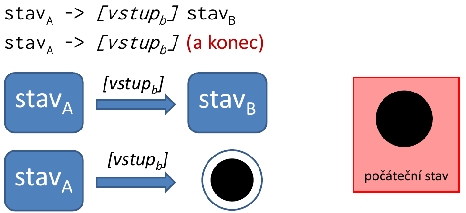

Hierarchicke:

- model: bezkontextove gramatiky, zasobnikovy automat  
- vstup musi byt vzdy oznaceny, inak moze vzniknut nekonecny cyklus  
- diagram - jedna sa o **variantu UML**:

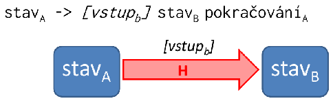

###### 2x Zretazene procesy vs Savepointy 

p6., slide 48 - Procesy, pokročilé modely procesů, cesta k workflow 

**Zreťazený Proces vs Savepoint**

**Samostatné transakcie z jednej väčšej vs jedna transakcia z dílčich častí**  
**návrat iba po posledný commit vs návrat vrámci savepointu v transakcii**  
**lokálne premenné stráca vs uchováva**  
**Nedodržiava ACID - Atomickosť nikdy a Izolovanosť sa dá ovplyvniť ( chain() ) vs Dodržiava** 

Sekvenčný model - savepoints: 

* Jedná sa o **jednu transakciu, ktorá v svojích podúlohach vytvára savepointy, na ktoré sa vracia v prípade výpadku.**  
* **Pomocou rollback(Savepoint) sa obnoví systém do stavu pri uložení Savepointu.** Savepoint **zachová lokálne premenné.** Potom sa pokračuje.  
* Pri zavolaní **abort(SavePoint) sa nepokračuje.**

Lokální proměnné se při rollbacku na poslední savepoint ponechávají - lze tak do nich např. uložit kudy jsme se pokoušeli rezervovat lety minule, když jsme pak museli rollbackovat protože tam bylo plno. Při dalším pokusu tak můžeme jít tou druhou cestou a realizovat tak backtracking**. Proč nevadí že se proměnné nerollbackují:** Transakce slouží především k přenosu dat z/do databáze. Pokud dojde k úspěšné transakci, uloží se milník typu STAV1\_DB. Na lokálních proměnných v tomto ohledu příliš nezáleží, důležité je, že databáze se nachází v požadovaném stavu a lze pokračovat v transakci od zvoleného milníku.

**Zretazene procesy:**  
**dlho trvajúce transakcie - objednávka, expedícia, fakturácia**  
**dekomponizujeme skrz:**

1. **Lepšiu výkonnosť =\> nemôže splňovať ACID**  
2. **Zabránenie straty celej práce. Nechceme rollbacknúť celý proces.**

**Transakcia sa rozloží na podtransakcie a oproti savopointom je každá podtransakcia samostatná transakcia, to znamená, že Chaining:**

1. **Po prevedení commit() sa už nedajú zmeny vrátiť.**   
2. **Nezachovávajú sa lokálne premenné: Pre koho sa robil nákup?**  
3. **Nie je atomická: V prípade výpadku nemusia byť vykonnané všetky podtransakcie**  
* **Alternatíva: Ukladanie do databáze**

  **Nevýhoda - súbežný prístup ostatných**

  	**Vyriešené pomocou locks**

**V okamžiku commitu podtransakcie sa môžu vykonať zmeny systému.**  
**Medzi S1 a S2 sa niečo stane a tým pádom S2 číta iné dáta ako S1 zapísala.**

**Data Context**

* **odomykanie z hľadiska efektu:**  
  * **Odomynie medzi S1 a S2, aby mohli bežať súbežné procesy to však spôsobí, že celá Transakcia izolovaná nie je, iba jej podtransakcie.**

**Alternatívna Sémantika pre získanie Izolovanosti**

* **miesto commit() sa použije chain()**  
  * **neuvoľní db context no zhorší výkonnosť**

**Roll Forward**

* **Aplikácia môže iba pokračovať, od tadiaľ kde bol prevedený posledný commit.**  
* **Pokračuje sa 2 spôsobmi:**  
  1. **dokončenie Transakcie**  
  2. **operácie, kt. zotavia do konzistentého stavu**  
     

**Kompenzujúce transakcie**

* **transakcie, ktoré nevytvoria rollback, ale snažia sa systém nejakou novou transakciou dostať do stavu predtým.**  
* **príklad: registrácia-deregistrácia uživateľa**

###### 1x Typy geografickych grafu / vizualizace geografických dat, co je GeoJSON a použití 

 

**Řešení:**

**Typy**

* **rastrové** - obrázky reprezentující reálnou mapu (*tiles*) - odpovídají aktuálnímu přiblížení, pozici (např. OpenStreetMap, Google Maps, Mapy.cz)  
* **vektorové** - polygony (státy), cesty (řeky), body (místa na mapě)  
* **kombinované** (nejpoužívanější) - rastrový podklad + vektorové překrývající se objekty (*overlays*)

**GeoJSON**

Formát pro kódování geografických dat (standardizovaný). Popisuje body, čáry, polygony atd. Hodnoty reprezentují zeměpisné souřadnice. Použití například pro reprezentaci státních hranic. Příklad:

**Dostupné knihovny**

D3 Kartogram, Leaflet, Google Maps API, Mapy.cz API

 

###### 1x dedicnost v objektovem modelu. definice jednoduche a vicenasobne dedicnosti + jejich grafy. 

****  
****

* U **jednoduché dědičnosti** každý následník smí mít pouze jediného předka. V grafické podobě dědičnosti to znamená, že ze žádného typu nesmí vycházet více, nežli jedna šipka. Takto zakreslený graf je potom stromem.  
* U **vícenásobné dědičnosti** není počet předků omezen. V grafické podobě dědičnosti to znamená, že z každého typu smí vycházet libovolný počet šipek. Takto zakreslený graf je obecný acyklický graf.

###### 1x Datový sklad - schéma, datový model, jak se liší od OLTP 

Online Analytical Processing & Business Intelligence - str11. / merged 516

 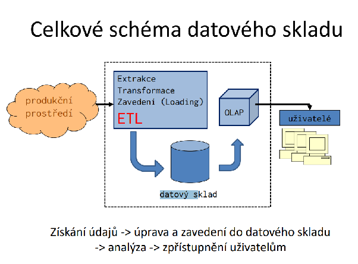

- Datovým skladem nazýváme technologii   
  - natažení (extrakce a transformation)   
  - uložení (loading) a   
  - poskytování dat pro podporu rozhodování prováděnou analýzou informací a vytvářením znalostí  
- je typicky provozován odděleně od základní operační databáze (též databáze detailů nebo produkční databáze)

datový model -  
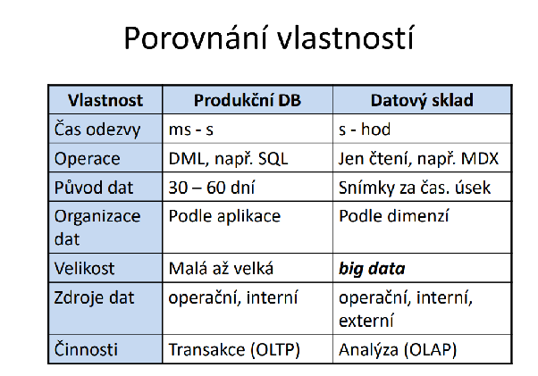

###### 1x Jak vypadá Bullet graf, co z něj lze vyčíst 

* funguje na stejném principu jako stupnice na teploměru  
* šikovná náhrada za kruhová měřidla (tachometry , gauges)  
* kompaktní, jednorozměrné  
* jednotlivé bullet grafy je možné skládat vedle sebe

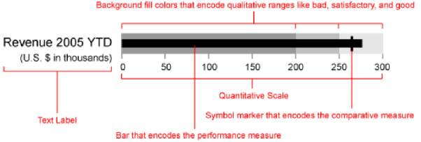

###### 1x Vícetypovost - k čemu je potřeba, jaký je s ní spojen problém, jak se řeší, uvést příklad 

vícetypovost je vícenásobná dědičnost (škaredé, fuj) pro persistentní objekty prováděná v čase běhu  
role: změna role objektu v čase u perzistentních objektů

Pokud objektem modelujeme jistou realnou skutecnost, je predpoklad existence jedineho  
koncoveho typu je nedostatecna. Pokud modelujeme Osobu, tak muze mit vice roli, muze  
byt student, muze byt ctenar ve knihovne …

V db aplikacich jsou objekty persistentni a neni mozne predem predpokladat jejich vsechny  
mozne koncove typy. Napr clovek jak bude rust, tak bude zakem, studentem, pracujicim,  
duchodcem … ruzne role. Navic lze vselijak kombinovat. Je tedy nutne umoznit vytvareni  
rychznych kombinaci koncovych typu v jedinem objektu behem jeho existence. A to je  
prave ta vicetypovost.

*Problemy?*  
Problém kolize: zamezení výskytu nedovolených kombinací mohou zajistit relace současné a výlučné existence místo relace dědičnosti.

###### TODO - 1x , definovat multidimenzionalni kostku, nakreslit 4D kostku pro time, item, location, supplier. Popísať kostku pro počet. 

**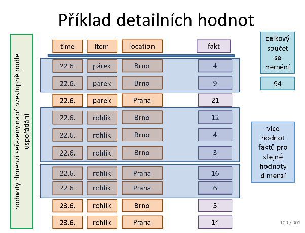**  
**TODO - Ako by ste robili tu ten pocet ? Ma byt ten pocet = 10 alebo 5 ? Maju sa najskor zlucit tie riadky, ktore maju rovnake hodnoty a az potom sa rata ten pocet?**
