# Preparation Speedrun

Táto stránka je transformovaný zdrojový súbor. Base64 obrázky boli vyextrahované do `assets/images`, aby ich Quartz normálne renderoval.

## PIS doc  

by LICH

## P1

### Architektúry IS

* **Dvojvrstvová (Klient-server):** Využíva dva druhy oddelených výpočetných systémov; „hrúbka“ klienta závisí od jeho inteligencie (množstva logiky, ktorú spracováva).  
* **Trojvrstvová architektúra (Three-tier):** Štandard pre moderné informačné systémy, ktorý oddeľuje:  
  * **Prezentačná vrstva:** Vizualizácia informácií (GUI), kontrola vstupov, neobsahuje spracovanie dát.  
  * **Aplikačná (Business) vrstva:** Jadro aplikácie, implementuje logiku, funkcie a výpočty.  
  * **Dátová vrstva:** Správa dát (databáza, súborový systém alebo webová služba).

**Tier vs. Layer**

* **Tier (Fyzická vrstva):** Jednotka nasadenia (deployment); určuje, na akom hardvéri/serveri časť systému beží (napr. DB server, aplikačný server).  
* **Layer (Logická vrstva):** Jednotka organizácie kódu v rámci aplikácie (napr. Data layer, Business layer, Presentation layer).

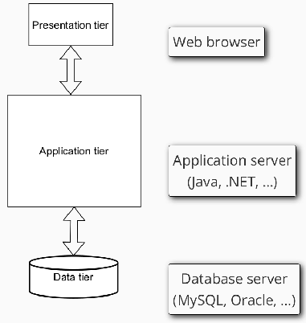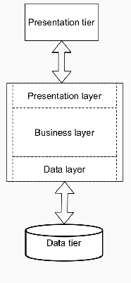

**Monolitická architektúra**

* **Charakteristika:** Systém sa vyvíja a nasadzuje ako **jeden celok** (jeden balík) s jednotnou technológiou a zdieľanou databázou.  
* **Výhody:** Jednoduchší vývoj a testovanie, rýchle úvodné nasadenie.  
* **Nevýhody:** Obtiažna aktualizácia častí, riziko, že aplikácia prerastie únosnú medzu, technologická závislosť (ťažký prepis pri zastaraní technológií).

**Mikroslužby (Microservices)**

* **Charakteristika:** Aplikácia je rozdelená na **malé, nezávislé časti**, ktoré komunikujú cez API (napr. REST).  
* **Vlastnosti:** Každá služba má vlastnú databázu, vlastnú business logiku a spravuje ju malý tím.  
* **Výhody:** Technologická nezávislosť služieb, jednoduché čiastkové aktualizácie, kontinuálny vývoj.  
* **Nevýhody:** Komplexné testovanie (závislosti), réžia sieťovej komunikácie, riziko reťazového zlyhania.

### P2 Java Backend

**Dependency Injection (DI)**

* **Princíp:** Ide o mechanizmus na **voľné prepojenie** (loose coupling) komponentov v aplikácii.  
* **Účel:** DI obmedzuje priame závislosti medzi triedami v kóde, čo zvyšuje **flexibilitu** (umožňuje jednoduchú výmenu implementácie) a uľahčuje **testovanie**.

**Contexts and Dependency Injection (CDI):**

* Moderný a obecný mechanizmus pre **Dependency Injection (DI)**.  
* Umožňuje voľné prepojenie tried, čo uľahčuje testovanie a údržbu.  
* Používa anotáciu `@Inject` na získanie inštancií objektov.  
* Definuje **životný cyklus (Scope)** objektov:  
  * `@Dependent`: (default) Objekt vzniká špecificky pre daný prípad (pre konkrétneho vlastníka, do ktorého je injektovaný). Jeho životný cyklus je pevne spätý s jeho vlastníkom – to znamená, že zaniká v rovnakom okamihu ako objekt, do ktorého bol vložený.  
  * `@RequestScoped`: Objekt žije počas jedného HTTP požiadavku.  
  * `@SessionScoped`: Objekt žije počas celej relácie používateľa.  
  * `@ApplicationScoped`: Jedna inštancia pre celú aplikáciu.
## P3 Objektový model dát

**Dedičnosť (Dědičnost)**

* **Princíp:** Definovanie nového typu (následníka) pomocou rozdielov (diferencií) oproti existujúcemu typu (predkovi).  
* **Tri druhy diferencií:**  
  * **Pridávanie** novej vlastnosti.  
  * **Modifikácia** (upresnenie) existujúcej vlastnosti.  
  * **Zrušenie** (vypustenie) vlastnosti.  
* **Hierarchia:**  
  * **Predok vs. Následník:** Typ, z ktorého sa dedí, je predok; odvodený typ je následník.  
  * **Jednoduchá dedičnosť:** Následník má iba jedného priameho predka (grafom je strom).  
  * **Vícenásobná dedičnosť:** Následník môže mať viacero priamych predkov (obecný acyklický graf).  
  * **Pravidlo cyklu:** V grafe dedičnosti sa nesmie vyskytovať cyklus – žiaden typ nemôže byť svojím vlastným predkom.

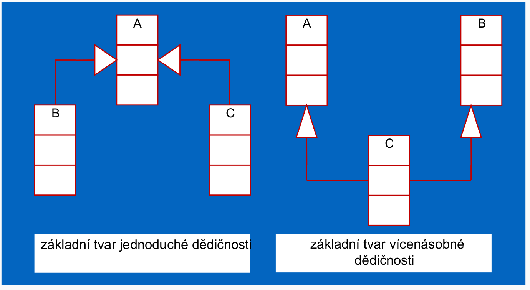

**Typová kompatibilita a Extent**

* **Kompatibilita:** Každá štruktúra určitého typu je zároveň typu všetkých svojich predkov. Následník je kompatibilný s predkom (napr. všade, kde sa očakáva "Osoba", môže vystupovať "Študent"), ale nie naopak.  
* **Extent:** Kolekcia všetkých existujúcich inštancií daného typu v databáze.  
  * Extent predka obsahuje aj všetky inštancie jeho následníkov.

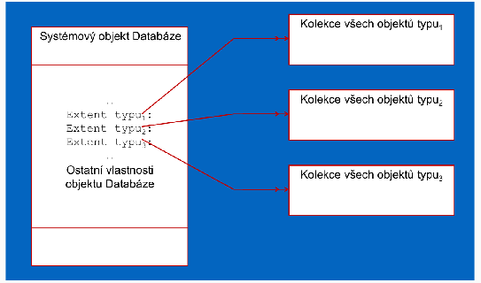

**Abstraktné a konkrétne typy**

* **Abstraktné typy:** Slúžia len ako vzory (stavebné kamene) pre následníkov a nemôžu mať vlastné inštancie (napr. "Ekonomický subjekt").  
* **Konkrétne typy:** Typy, ktoré reálne vytvárajú inštancie/objekty (napr. "Banka").

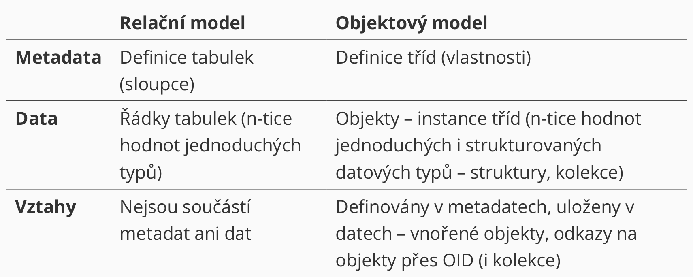

## P4

### Popis služieb v REST

Keďže architektúra REST môže byť pri voľnom pridávaní endpointov chaotická, je dôležitý ich formálny popis:

### Spôsoby autentizácie v REST

REST je podľa definície **bezstavový**, čo znamená, že každá požiadavka musí obsahovať všetky údaje potrebné na spracovanie (teoreticky to vylučuje sessions na serveri).

* **HTTP Basic autentizácia:**  
  * Meno a heslo sa posielajú v hlavičke `Authorization`.  
  * Údaje sú len kódované (base64), preto je **nevyhnutné použiť HTTPS**.  
  * Ak chýba autentizácia, server vráti kód **401 Unauthorized**.  
* **Tokeny (napr. JWT):** Token je validovateľný priamo na serveri bez nutnosti držať session.  

### JSON Web Token (JWT)

JWT je kompaktný řetězec, ktorý slúži na bezpečný prenos informácií medzi stranami ako objekt JSON.

* **Štruktúra (tri časti spojené bodkou):**  
  * **Header (hlavička):** Obsahuje typ tokenu a použitý algoritmus podpisu.  
  * **Payload (obsah):** Dáta vo forme "claims" (napr. ID používateľa, jeho roly/skupiny, čas expirácie). Claims:  
    * **iss (Issuer):** **vydavateľ tokenu**  
    * **upn (User Principal Name):** **jednoznačné meno používateľa** (identifikátor)  
    * **groups:** **zoznam rolí alebo skupín**, do ktorých je používateľ zaradený  
  * **Signature (podpis):** Slúži na overenie, že token nebol cestou zmenený (integrita).  
  * 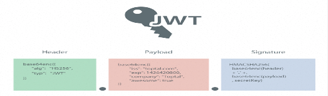  
* **Proces použitia:**  
  * Klient pošle prihlasovacie údaje na autentizačný server.  
  * Server vygeneruje a **podpíše JWT** (privátnym kľúčom), ktorý vráti klientovi.  
  * Klient ukladá token a posiela ho v každej požiadavke v hlavičke: `Authorization: Bearer <token>`.  
* **JWT v Jave (MicroProfile):**  
  * Nie je priamo v jadre Jakarta EE, ale je súčasťou **MicroProfile**, čo moderné servery (Payara, Liberty) podporujú.  
  * **Autorizácia v kóde:** Zapína sa anotáciou `@LoginConfig(authMethod = "MP-JWT")` v konfigurácii JAX-RS.  
  * Prístup k endpointom sa riadi anotáciou **@RolesAllowed**, ktorá kontroluje roly definované priamo v tokene.

### GraphQL

* **Problém RESTu:** REST endpointy vracajú vždy fixnú štruktúru dát, čo vedie k redundancii (klient dostane viac dát, než potrebuje) alebo k potrebe viacerých dotazov na získanie súvisiacich informácií.  
* **Riešenie GraphQL:** Klient si v dotaze sám špecifikuje **presný tvar odpovede**, ktorú potrebuje.  
* **Výhody:** Predvídateľný výsledok, eliminácia nadbytočných dát a vyššia efektivita pri získavaní dát, ktoré sú "drahé" na spracovanie.

**Dátový model (Schéma)**

* **Typy dát:** Využíva jednoduché typy (Int, Float, String, Boolean, ID, enum) a užívateľské štruktúry.  
* **Root types (Koreňové typy):** Špeciálne typy reprezentujúce samotné volanie API:  
  * **Query:** Slúži výhradne na čítanie dát.  
  * **Mutation:** Slúži na zmenu dát (zápis, aktualizácia, mazanie).  
* **SDL (Schema Definition Language):** Jazyk na formálnu definíciu typov a operácií.

**Operácie a komunikácia**

* **Dotazy (Queries):** Umožňujú vyžiadať si konkrétne polia (vlastnosti) objektov, a to aj zanorených (napr. osoba a jej autá).  
* **Modifikácie (Mutations):** Definujú parametre pre zmenu dát a návratovú hodnotu (napr. ID vytvoreného objektu).  
* **GraphQL cez HTTP:**  
  * Využíva sa **jediné endpoint URL** pre všetky operácie.  
  * Dáta sa posielajú cez **POST** (ako JSON s kľúčom "query") alebo cez **GET** priamo v URL.

## P5

### Ďalšie architektúry API

**WSDL (Web Services Description Language)**

* **Účel:** Slúži na **formálny popis rozhraní** webových služieb nezávislý od platformy.  
* **Formát:** Ide o XML dokument, ktorý využíva XML menné priestory (Namespaces) a XML schémy.  
* **Čo definuje:**  
  * Názvy dostupných funkcií.  
  * Ich vstupné a výstupné parametre.  
  * Spôsob volania vrátane cieľovej URL adresy.  
* **Využitie v praxi:**  
  * Umožňuje **automatické generovanie rozhraní** v cieľovom programovacom jazyku (tzv. **„Stub“** – zástupná metóda pre volanie cez HTTP).  
  * Funguje to aj opačne – z existujúceho kódu možno vygenerovať WSDL popis.

**SOAP**

* **Charakteristika:** Komplikovaný štandard pre webové služby, ktorý vznikol ako snaha o maximálnu štandardizáciu volaní cez HTTP.  
* **Úloha:** Predstavuje samotný **protokol pre volanie** služby a prenos dát.  
* **Štruktúra správy:** Dáta sú zabalené v XML obálke (`<env:Envelope>`), ktorá sa delí na hlavičku (`<env:Header>`) a telo (`<env:Body>`).  
* **Porovnanie:** Na rozdiel od RESTu, ktorý je flexibilný, SOAP striktne vyžaduje WSDL popis a XML formát.

### Synchrónna komunikácia

* **Charakteristika:** Ide o najčastejší spôsob komunikácie, typicky realizovaný cez **REST**.  
* **Princíp:** Klientska služba odošle požiadavku a následne **čaká na odpoveď** od volanej služby, čo spôsobuje **blokovanie** jej ďalšej činnosti.  
* **Nevýhody:** Ak volaná služba nie je dostupná, klientska služba musí čakať (timeout) alebo sama zlyhá.

### Asynchrónna komunikácia

* **Charakteristika:** Služba odošle správu a **nečaká na okamžitú odpoveď**, čím môže plynule pokračovať vo svojej práci.  
* **Sprostredkovateľ:** Výmenu správ medzi službami zabezpečuje centrálny **message broker**.

#### Message Broker a jeho modely

Message broker je samostatný systém, ktorý garantuje doručenie správ medzi producentmi a konzumentmi. Existujú dva hlavné modely doručovania:

* **1\. Message Queue (Fronta správ):**  
  * Zprávy od konkrétneho producenta sa radia do fronty pre **jedného konkrétneho konzumenta**.  
  * **Príklady:** RabbitMQ, Apache ActiveMQ, Amazon SQS.  
* **2\. Publish / Subscribe (Publikácia / Odber):**  
  * Zprávy sú priraďované k určitým **témam (topics)**.  
  * Producent publikuje správu do témy a správa je doručená **všetkým konzumentom**, ktorí sú prihlásení na odber danej témy.  
  * **Príklady:** Apache Kafka, Pulsar, Amazon SNS.

## P6 Procesy

**Procesy v IS:** Realizujú transformácie dát (často ako transakcie) a menia stav systému; mali by byť izomorfné s realitou.

### Transakčné spracovanie (ACID)

* **ACID:** Atomickosť (všetko alebo nič), Konzistencia (pravidlá DB), Izolovanosť (nerušenie sa), Trvanlivosť (prežitie havárie).  
* **Zodpovednosť:** Programátor zodpovedá za **konzistenciu**; TPS (systém) automaticky zaisťuje ostatné vlastnosti.  
### Pokročilé modely a distribuované transakcie

* **Zretězené transakcie (Chained):** Sekvencia podtransakcií, kde každá sa potvrdzuje samostatne; kratšie zámky, vyšší výkon.  
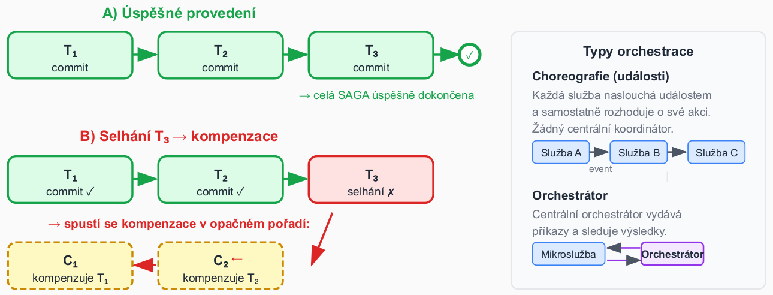

**Zotaviteľné fronty a reálne udalosti**

* **Zotaviteľná fronta:** Mechanizmus pre plánovanie budúcich transakcií; musí prežiť haváriu.  
* **Vlastnosti:** Ak transakcia vykoná rollback, záznam musí zmiznúť z fronty (atomičnosť spojenia DB a fronty).  
* **Reálne udalosti:** Fyzické akcie (napr. vydanie peňazí), ktoré nemajú rollback; riešia sa cez dopredný návrat a zotaviteľné fronty.  
* **Technológie:**  
  * **Jakarta Messaging (JMS):** Štandard pre prácu s message brokermi; podporuje XA transakcie.  

## P7 Workflow

*(asi až zbytočne veľa naslopovaných poznámok o tejto téme nakoľko sa o toto prebralo za menej ako hodinu)*

### Podnikové (business) procesy

* Slúžia ako **koordinačný mechanizmus** naprieč organizačnými jednotkami, distribuovaný v čase a priestore.  
* Integrujú a koordinujú distribuované zdroje.  
* Zabezpečujú doručenie **správnej informácie správnemu človeku v správny čas** (odpovedajú na otázky: ČO, AKO, KEDY a KTO).  
* Z hľadiska technológie ide o **popis procesov mimo vlastnej implementácie IS** a o infraštruktúru schopnú tieto popisy vykonať.

### Workflow a jeho vzťah k procesom

* **Definícia:** Ide o **procedurálnu automatizáciu** business procesu, ktorá spravuje sekvenciu aktivít a vyvoláva príslušné zdroje.  
* **Rozdiel medzi business procesom a workflow:**  
  * **Business proces:** Obecnejší pohľad z organizačnej perspektívy.  
  * **Workflow:** Konkrétny popis technickej realizácie a implementácie procesu.

**Prechod od front k workflow**

* **Zotaviteľné fronty:** Tvoria základ pre sekvenovanie; zaručujú len to, že po dokončení akcie A sa niekedy vykoná akcia B.  
* **Workflow pridáva navyše:**  
  * **Jazyk na popis procesov:** Formálna definícia aktivít, podmienok a vetvenia.  
  * **Roly a swimlanes:** Priradenie aktivít konkrétnym účastníkom.  
  * **Smerovanie:** Využitie logických brán (XOR/AND/OR) namiesto ručne programovanej logiky.  
  * **Monitoring a analýza:** Sledovanie stavu inštancií a výkonnostných metrík.

#### Štandardizácia a WfMC

* **WfMC (Workflow Management Coalition):** Medzinárodná nezisková organizácia (založená v roku 1993), ktorá vznikla kvôli potrebe integrácie veľkého množstva softvérových nástrojov pre workflow.  
* **Oblasti štandardizácie:**  
  * Jednotná terminológia a **referenčný model**.  
  * Spolupráca a prepojenie rôznych WF systémov.  
  * Formáty pre výmenu definícií procesov (od XPDL k súčasnému **BPMN 2.0 XML**).

**Referenčný model WfMC**  
Model definuje centrálne rozhranie **WES**, na ktoré sa cez päť špecifických rozhraní pripájajú ostatné komponenty systému:

1. **Rozhranie 1:** Nástroje pre definíciu procesov.  
2. **Rozhranie 2:** Klientske aplikácie workflow.  
3. **Rozhranie 3:** Vyvolané aplikácie.  
4. **Rozhranie 4:** Iné systémy WES.  
5. **Rozhranie 5:** Administratívne a monitorovacie nástroje.

#### WES a Workflow Engine

* **WES (Workflow Enactment Service):** Služba, ktorá zabezpečuje vykonanie správnej činnosti pomocou správneho prostriedku v správny čas; skladá sa z jedného alebo viacerých workflow enginov.  
* **Workflow Engine:** Jadro systému, ktoré:  
  * Interpretuje formálnu definíciu procesu.  
  * Vytvára inštancie procesov a riadi ich priebeh.  
  * Zabezpečuje prechody medzi aktivitami a vytvára pracovné položky (work items).  
  * Umožňuje administráciu a dohľad nad procesmi.

**Hlavné prvky WF systému**

* **Klientske aplikácie:** Rozhrania pre používateľov, ktorí cez ne vykonávajú jednotlivé úlohy.  
* **Vyvolané aplikácie:** Softvérové nástroje spúšťané automaticky systémom pri začatí úlohy.  
* **Nástroje pre definíciu:** Grafické editory (typicky **BPMN**) na modelovanie správ, udalostí a rozhodovacích pravidiel.  
* **Nástroje pre analýzu a verifikáciu:**  
  * **Simulácia:** Overovanie modelu a predikcia správania („čo sa stane, keď...?“).  
  * **Verifikácia:** Matematické metódy (napr. **Petriho siete**) na overenie, či proces vždy dôjde do cieľa.  
* **Administrácia a monitorovanie:** Sledovanie stavu inštancií v reálnom čase, kontrola lehôt (**SLA**) a meranie výkonnosti.

#### 3D pohľad na workflow (dimenzie)

Model workflow možno vnímať cez tri základné osi, ktoré definujú jeho fungovanie:

* **Case dimension (Prípad):** Predstavuje konkrétny riešený problém (napr. konkrétna „žiadosť o pôžičku“), ktorý zvyčajne generuje externý zákazník. Spracúva sa vykonávaním úloh v určenom poradí.  
* **Process dimension (Proces):** Definuje **úlohu (task)** ako krok vykonávania procesu, ktorý je charakterizovaný podmienkami pred (precondition) a po (postcondition) jeho vykonaní.  
* **Resource dimension (Zdroj):** Zahŕňa zariadenia alebo osoby (zdroje), ktoré prácu vykonávajú.  
  * **Pracovná položka (work item):** Úloha pre konkrétny prípad.  
  * **Činnosť (activity):** Spojenie úlohy s konkrétnym zdrojom, ktoré vytvára front (worklist).

#### Role a dáta vo workflow

Prácu vo workflow nevykonávajú pracovníci náhodne, ale na základe priradených kompetencií a údajov:

* **Role:** Predstavujú triedu zdrojov podľa schopností (napr. „programátori“). Jedna osoba môže mať viacero rolí a mnoho osôb môže zdieľať rovnakú rolu. Role sú autorizované spracovávať požiadavky z front prislúchajúcich k činnostiam.  
* **Typy dát vo workflow:**  
  * **Riadiace dáta:** Interné údaje workflow systému, ktoré sú navonok nedostupné.  
  * **Vecné dáta:** Slúžia na rozhodovanie v rámci procesu a sú prístupné aj aplikáciám.  
  * **Aplikačné dáta:** Dáta špecifické pre konkrétne aplikácie, ku ktorým workflow systém nemá prístup.  
* **Organizačný model:** Definuje role a vzťahy medzi nadriadenými a podriadenými.  
* **Zoznam úloh (Worklist):** Aktuálne úlohy pre používateľa, ktoré môžu byť pridelené postupne (skryté) alebo si ich používateľ volí sám.

#### Životný cyklus workflow

Životný cyklus workflow pozostáva z piatich nadväzujúcich fáz:

1. **Definícia procesu:** Modelovanie procesu v grafickom editore (najčastejšie pomocou štandardu **BPMN**).  
2. **Nasadenie (Deployment):** Prenos hotovej definície procesu do workflow enginu.  
3. **Spustenie inštancií:** Vytváranie a riadenie konkrétnych bežiacich prípadov (instancií).  
4. **Monitorovanie:** Sledovanie stavu inštancií, dodržiavania lehôt (**SLA**) a využitia zdrojov.  
5. **Analýza a optimalizácia:** Identifikácia úzkych miest v procese a následná úprava modelu pre zvýšenie efektivity.

### Ciele Business Process Managementu (BPM)

* **Formálny popis:** Snaha o presné zachytenie procesov prebiehajúcich v rámci organizácie.  
* **Riadenie:** Využitie popísaných modelov na riadenie reálneho chodu pomocou **WFM systémov**.  
* **Zvyšovanie efektivity:** Možnosť následnej analýzy a verifikácie procesov.

#### Štandardy pre modelovanie

* **BPMN 2.0 (Business Process Model and Notation):** Aktuálny primárny štandard, ktorý kombinuje grafickú notáciu s natívnou **XML serializáciou** (BPMN XML). Definície sú priamo spustiteľné v BPMN enginoch (napr. Camunda, Flowable).  
* **Historické formáty (legacy):**  
  * **XPDL:** Pôvodný deskriptívny formát WfMC.  
  * **BPEL (WS-BPEL):** Procedurálny jazyk orientovaný na webové služby.

**Základné elementy BPMN**  
BPMN využíva špecifické kategórie objektov na vizualizáciu toku procesu:

* **1\. Události (Events):** Ovplyvňujú tok procesu (začiatok, koniec, zmena stavu).  
  * **Start (tenký okraj):** None, časovač, správa, signál.  
  * **Mezilehlá (dvojitý okraj):** Časovač, správa, chyba, eskalácia.  
  * **Konec (silný okraj):** None, správa, chyba, ukončenie (terminate).  
  * **Boundary (hraničné):** Prichytené k aktivite; môžu byť **prerušujúce** (zastavia aktivitu) alebo **neprerušujúce** (spustia paralelný tok).  
* **2\. Aktivity (Activities):** Práca, ktorá sa má vykonať; zahŕňa atomické **úlohy (tasks)**, podprocesy alebo opakujúce sa úlohy.  
* **3\. Brány (Gateways):** Riadia vetvenie a slučovanie toku.  
  * **XOR (výlučné):** Práve jedna vetva.  
  * **AND (paralelné):** Všetky vetvy súčasne.  
  * **OR (inkluzívne):** Jedna alebo viacero vetiev.  
* **4\. Spojovacie objekty:**  
  * **Sekvenčný tok (plná šipka):** Určuje poradie aktivít.  
  * **Tok správ (přerušovaná šipka):** Komunikácia medzi rôznymi účastníkmi (poolmi).  
  * **Asociácia:** Prepojenie objektov s textovými poznámkami alebo artefaktmi.

**Plavecké dráhy (Swimlanes)**

* **Pool:** Reprezentuje celého účastníka procesu (napr. organizáciu alebo systém).  
* **Lane:** Rozdeľuje pool na kategórie, ktoré zvyčajne zodpovedajú konkrétnym **rolám alebo oddeleniam**.

**Kompenzácia v BPMN**

* BPMN 2.0 obsahuje vstavanú podporu pre logické „vrátenie“ efektu dokončenej aktivity (napr. vrátenie platby, ak zlyhalo odoslanie tovaru).  
* Využíva sa na to **kompenzačná úloha** spúšťaná špeciálnou kompenzačnou udalosťou.

**Vrstvy modelovania procesov**

1. **Vrstva 1 – BPMN notácia:** Grafické diagramy vytvorené v nástrojoch ako Camunda Modeler alebo draw.io.  
2. **Vrstva 2 – BPMN 2.0 XML:** Prenositeľná strojová reprezentácia procesu určená na nasadenie (deploy).  
3. **Vrstva 3 – BPMN engine:** Softvérové jadro, ktoré interpretuje XML a riadi bežiace inštancie (napr. Camunda, Kogito).

#### Workflow Patterns (Vzory riadenia toku)

Tieto vzory slúžia na definovanie logiky smerovania v procese bez nutnosti ručného programovania. Medzi základné patria:

* **Sekvencia (Sequence):** Najzákladnejší vzor; úloha sa spustí až po dokončení predchádzajúcej.  
* **Paralelné vetvenie a synchronizácia (AND):**  
  * **Parallel Split (AND-split):** Rozdelí tok do viacerých paralelných vlákien spustených súčasne.  
  * **Synchronizácia (AND-join):** Čaká na dokončenie všetkých paralelných vlákien, kým povolí ďalší krok.  
* **Výlučné rozhodnutie a jednoduché spojenie (XOR):**  
  * **Výlučné rozhodnutí (XOR-split):** Na základe podmienky sa vyberie práve jedna vetva.  
  * **Jednoduché spojení (XOR-merge):** Spojí nezávislé vetvy; proces pokračuje okamžite, keď ľubovoľná vetva dosiahne bod spojenia (nečaká sa na ostatné).  
* **Vícenásobná volba a synchronizujúce zlúčenie (OR):**  
  * **Vícenásobná volba (OR-split):** Aktivuje jednu alebo viacero vetiev podľa podmienok.  
  * **Synchronizující sloučení (OR-join):** Čaká len na tie vetvy, ktoré boli reálne spustené.

#### Flexibilita workflow

Flexibilita je nevyhnutná, pretože podmienky pre chod organizácie sa neustále menia (napr. zmena legislatívy či reštrukturalizácia). Zdroje rozlišujú dva prístupy k jej zabezpečeniu:

1. **Dopredná flexibilita:** Snaha uvažovať o všetkých možných situáciách a variantoch už pri návrhu procesu.  
2. **Zpětná flexibilita (Dynamická evolúcia):** Schopnosť zmeniť definíciu workflow za behu, pričom na realizáciu týchto zmien sa využívajú tzv. **evolution patterns**.

**Správa existujúcich inštancií pri zmene**  
Pri zmene schémy procesu (napr. prechod z verzie 1 na verziu 2) je kľúčové rozhodnúť, čo so starými, rozpracovanými prípadmi:

* **Concurrent to completion:** Najbezpečnejší prístup; staré inštancie dobehnú podľa pôvodného schématu, nové už podľa nového. Nevýhodou je, že v systéme existuje viacero verzií súčasne, čo komplikuje monitoring.  
* **Migrace na finální schéma:** Existujúce inštancie sa okamžite prevedú na nové schéma. Podmienkou je, že inštancia musí byť v **kompatibilnom stave** (napr. nesmie byť v aktivite, ktorá v novej verzii neexistuje).  
* **Migrace na ad-hoc schéma:** Najflexibilnejší, ale najzložitejší spôsob; vytvorí sa dočasné „mostové“ schéma, ktoré prevedie inštanciu zo starého stavu do bodu kompatibilného s novým procesom.

### Moderné technológie a nástroje Workflow

**Moderné BPMN 2.0 enginy**  
Enginy slúžia na interpretáciu a riadenie inštancií procesov definovaných v BPMN XML.

* **Camunda 7:** Najrozšírenejší open-source engine (Java); ponúka REST API, embedded aj standalone režim.  
* **Camunda 8 / Zeebe:** Cloud-native distribuovaný engine; škálovateľný, poskytovaný ako SaaS alebo self-hosted.  
* **Flowable:** Odvodený od Activiti; ľahší engine so silnou integráciou na Spring Boot.  
* **Activiti:** Základ celého ekosystému, spravovaný spoločnosťou Alfresco.  
* **Kogito (Red Hat):** Cloud-native nástupca jBPM určený pre Quarkus a Kubernetes; kombinuje BPMN a DMN.  
* **Bonitasoft:** Low-code platforma s grafickým štúdiom pre tzv. citizen developerov.

#### Moderné prístupy: Orchestrácia vs. Choreografia

Dva odlišné spôsoby koordinácie služieb v rámci procesu:

* **Orchestrácia (centrálna):**  
  * Využíva **centrálny BPMN engine**, ktorý pozná celý stav procesu.  
  * **Výhody:** Centrálnu viditeľnosť, jednoduchšie ladenie a monitoring.  
  * **Nevýhody:** Engine je „single point of failure“ a možný úzke miesto (bottleneck) pri škálovaní.  
* **Choreografia (decentralizovaná):**  
  * **Event-driven** prístup bez centrálneho koordinátora; služby komunikujú cez Message brokera (napr. Kafka).  
  * **Výhody:** Prirodzená škálovateľnosť, voľné väzby medzi službami.  
  * **Nevýhody:** Stav je distribuovaný (ťažšie sledovanie), zložitejšie ladenie a testovanie.

#### Moderné distribuované workflow

* **Temporal (temporal.io):** Prístup „workflow ako kód“ (Java, Python, Go, TypeScript); ponúka automatický retry, timeouty a zotavenie bez straty stavu.  
* **Cloudové managed služby:**  
  * **AWS Step Functions:** Vizuálny stavový stroj (serverless).  
  * **Azure Logic Apps:** Low-code riešenie s rozsiahlym ekosystémom konektorov.  
  * **Google Cloud Workflows:** Definícia cez YAML/JSON pre integráciu GCP služieb.  
  * **Spoločný znak:** Serverless model s platbou za prechody; nevýhodou je vendor lock-in.

#### Process Mining

Automatické objavovanie procesov z **event logov** (záznamy v tvare `[caseID, aktivita, čas]`).

* **Kľúčové úlohy:**  
  * **Discovery:** Rekonštrukcia modelu procesu priamo z logov.  
  * **Conformance checking:** Porovnanie skutočného priebehu v systéme s navrhnutým BPMN modelom.  
  * **Enhancement:** Doplnenie modelu o reálne výkonnostné metriky.  
* **Nástroje:**  
  * **ProM:** Akademická platforma (TU/e).  
  * **Celonis:** Popredné komerčné riešenie.  
  * **Disco / Bupar (Python):** Ľahšie nástroje na analýzu.

## P8 Business intelligence a OLAP

### Dátový sklad (Data Warehouse – DWH)

Dátový sklad je podnikovo štruktúrovaný depozitár dát určený na podporu rozhodovania, ktorý obsahuje operačné aj agregované dáta.

* **Vlastnosti dátového skladu:**  
  * **Orientácia podľa subjektu:** Fakty sú organizované podľa priesečníkov n-dimenzií.  
  * **Integrácia:** Dáta z rôznych zdrojov sú ukladané jednotne (jednotná terminológia, merné jednotky) po predchádzajúcom vyčistení.  
  * **Časová premenlivosť:** Každý kľúč obsahuje časový údaj; historický horizont je typicky 5–10 rokov (na rozdiel od aktuálnych dát v OLTP).  
  * **Nemennosť:** Dáta sa v sklade neprepisujú, vykonávajú sa len operácie vkladania a čítania. Nepotrebuje transakčné spracovanie ani zložité mechanizmy súbežného prístupu.  
* **Architektúra dátového skladu (3 časti):**  
  * **Získanie dát:** Zahŕňa zdrojové dáta a miesto prípravy (proces **ETL** – Extraction, Transformation, Loading).  
  * **Uloženie dát:** Samotný dátový sklad, menšie celky (dátové trhy) a úložisko metadát. Sklad je navrhnutý ako **read-only** pre potreby analýzy.  
  * **Odovzdávanie výsledkov:** Výstupné rozhrania ako OLAP, dotazovacie nástroje, generátory správ a nástroje pre data mining.  
* **Zhrnutie požiadaviek na dátový sklad:**  
  * Schopnosť vykonávať **agregácie** (súčty, priemery a pod.).  
  * Databázový model navrhnutý pre **analytické dotazy**.  
  * Možnosť integrovať dáta z viacerých heterogénnych aplikácií.  
  * Prevaha operácie čítania nad zápisom.  
  * Pravidelné, periodické dopĺňanie nových dát.  
  * Súčasné využitie aktuálnych aj historických údajov.

**1\. Multidimenzionálny model (Dimenzie a Fakty)**  
Základom modelu je **multidimenzionálna kocka**, ktorá je matematicky definovaná ako funkcia: gm​:(A1​×A2​×A3​×⋯×Am​)→F

* **Dimenzie (**Ai​**):** Usporiadané množiny hodnôt (napr. Čas, Produkt, Miesto), ktoré definujú súradnice v kocke.  
* **Fakty (**F**):** Agregovateľné číselné hodnoty (množina faktov) nachádzajúce sa na priesečníkoch dimenzií (napr. objem predaja, tržba).

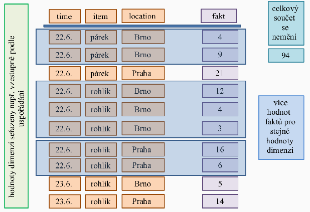

**2\. Agregácie a prvý krok výpočtu**  
V reálnom systéme existujú **detailné hodnoty** (napr. jednotlivé transakcie), ktorých môže byť pre rovnaké súradnice dimenzií viacero.

* **Prvý krok agregácie:** Prevedie tieto detaily na tzv. **základný kuboid** (n-rozmerná kostka so všetkými dimenziami), kde je pre každú kombináciu súradníc už len jeden agregovaný fakt.  
* **Matematicky (pre súčet):** soucˇetn​(d1​,…,dn​)=∑detail(d1​,d2​,…,dn​)

**3\. Podkocky (Kuboidy) a ich hierarchia**  
Z pôvodnej n-rozmernej kostky možno odvodzovať **podkocky (kuboidy)** s menším počtom dimenzií pomocou operácie **roll-up**.

* **Množina podkociek** tvorí čiastočne uspořádanú množinu – **zväz kuboidov** (lattice).  
* **Základný kuboid (n-D):** Obsahuje fakty pre všetky aktívne dimenzie.  
* **Vrcholový kuboid (0-D):** Predstavuje jediný agregovaný fakt cez úplne všetky dimenzie (celkový súčet za všetko).

**Príklad: Predaj pečiva**  
Predstavme si kocku s 3 dimenziami: **Čas** (d1​), **Produkt** (d2​) a **Miesto** (d3​).

1. **Detailné hodnoty (transakcie):**  
   * 22.6., rohlík, Brno → 12 ks  
   * 22.6., rohlík, Brno → 4 ks  
2. **Prvý krok (Základný 3D kuboid):** Sčítame detaily pre rovnaké súradnice: soucˇet3​(22.6.,rohlıˊk,Brno)=12+4=16.  
3. **Podkocka (2D kuboid bez dimenzie Miesto):** Agregujeme (sčítame) hodnoty cez všetky mestá pre daný čas a produkt: soucˇet2​(22.6.,rohlıˊk)=miesto∈{Brno,Praha}∑​soucˇet3​(22.6.,rohlıˊk,miesto) Ak sa v Prahe predalo 22 ks a v Brne 19 ks, výsledok v 2D podkocke bude **41**.  
4. **Vrcholový kuboid (0D):** Agregujeme úplne všetko. Ak celkový súčet všetkých predajov (všetky dni, produkty aj mestá) vyjde napr. **94**, vrcholový kuboid obsahuje len túto jednu hodnotu.

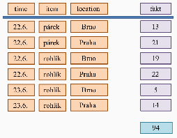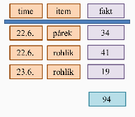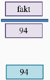

### Architektúry OLAP serverov

Existujú tri základné prístupy k ukladaniu a spracovaniu analytických dát:

* **MOLAP (Multidimensional OLAP):**  
  * Využíva vlastné **multidimenzionálne dátové štruktúry** (polia, riedke matice).  
  * Dáta sú predzpracované a agregované, čo zabezpečuje **maximálny výkon** pri indexovaní.  
  * **Nevýhody:** Vysoká redundancia a veľké nároky na úložný priestor.  
  * **Príklady:** Oracle Essbase, Jedox.  
* **ROLAP (Relational OLAP):**  
  * Dáta ostávajú v **relačných tabuľkách**, ale navonok sú prezentované ako multidimenzionálny pohľad.  
  * **Výhody:** Žiadna redundancia a výborná možnosť škálovania.  
  * **Príklady:** ClickHouse, Apache Kylin, cloudové riešenia ako Google BigQuery alebo Amazon Redshift.  
* **HOLAP (Hybrid OLAP):**  
  * Kombinuje oba prístupy: **detailné dáta** sú v relačných tabuľkách (ROLAP) a **predagregáty** v multidimenzionálnych štruktúrach (MOLAP).  
  * **Príklady:** Microsoft SSAS, SAP BW.

**Konceptuálne modelovanie (Schémy)**

Pri návrhu štruktúry dátového skladu sa využívajú tri základné typy schém:

* **Schéma hviezdy (Star schema):**  
  * Pozostáva z jednej **centrálnej tabuľky faktov**, ku ktorej sú pripojené tabuľky dimenzií.  
  * Relácie dimenzií **nie sú normalizované**, čo model zjednodušuje, ale môže spomaliť spracovanie.  
  * Neposkytuje priamu podporu pre hierarchie (rieši sa organizačne).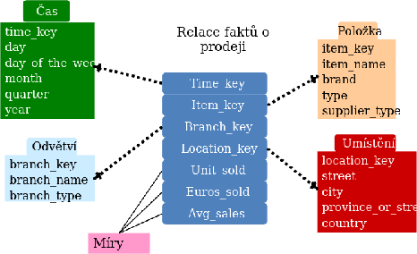  
* **Schéma snehovej vločky (Snowflake schema):**  
  * Ide o zjemnenie hviezdy, kde je **hierarchia dimenzií normalizovaná** do viacerých naviazaných tabuliek.  
  * **Výhody:** Lepšia konzistencia dát a jednoduchšia údržba dimenzií.  
  * **Nevýhody:** Zložitejšie analytické dotazy.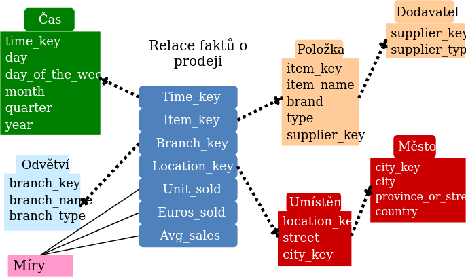  
* **Konstelácia faktov (Fact constellation / Galaxy schema):**  
  * Obsahuje **viacero tabuliek faktov**, ktoré navzájom zdieľajú spoločné tabuľky dimenzií.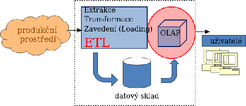

**Charakteristika tabuliek**

* **Tabuľka faktov:** Zvyčajne najväčšia a často jediná tabuľka v databáze. Obsahuje numerické miery (napr. tržba, cena, počet) a cudzie kľúče do tabuliek dimenzií.  
* **Tabuľky dimenzií (číselníky):** Obsahujú popisné údaje usporiadané logicky alebo hierarchicky. Sú menšie, menia sa menej často a najčastejšie reprezentujú čas, geografiu alebo produkty.

### OLAP operácie nad kockou

Umožňujú používateľom interaktívne skúmať a analyzovať multidimenzionálne dáta uložené v dátovom sklade. Medzi základné operácie nad dátovou kockou patria:

* **Roll-up (Vyrolovanie):** Predstavuje posun o úroveň vyššie v hierarchii kuboidov, čím dochádza k **zvýšeniu úrovne agregácie**. V praxi to znamená napríklad prechod od zobrazenia dát po mesiacoch k zobrazeniu po kvartáloch alebo rokoch.  
* **Drill-down (Zavŕtanie):** Je opačnou operáciou k roll-up. Znamená posun o úroveň nižšie, čo vedie k **zvýšeniu detailu** pridaním ďalšej dimenzie. Príkladom je rozpad ročných predajov na jednotlivé mesiace.  
* **Pivoting (Pretočenie):** Táto operácia mení usporiadanie (poradie) dimenzií v rámci aktuálneho pohľadu bez toho, aby sa menila ich množina. Ide v podstate o otočenie niektorej zo stien kocky smerom k používateľovi (napr. zmena z `čas × produkt` na `produkt × čas`).  
* **Slicing (Seříznutí / Rez):** Výber konkrétnej projekcie zafixovaním hodnoty v jednej dimenzii pomocou filtra. Príkladom je obmedzenie zobrazenia dát len na konkrétny región (napr. `región = Praha`).  
* **Dicing (Kockovanie):** Ide o zložitejšiu formu filtrovania, kde sa nastavujú obmedzujúce podmienky (predikáty) cez **viacero dimenzií súčasne**. Príkladom môže byť výber dát pre kombináciu: `Praha + Q1 2024 + kategória elektro`.

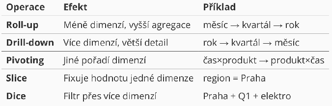

## P9 Vizualizácia dát

### Webová vizualizácia dát

#### Canvas

Canvas (v preklade „plátno“) je element HTML5, ktorý umožňuje dynamické vykresľovanie **rastrovej grafiky** pomocou skriptovacieho jazyka, zvyčajne JavaScriptu.

* **Charakteristika:**  
  * Ide o **rastrový prístup**, kde sa grafika vykresľuje pixel po pixeli.  
  * Grafické prvky (napr. nakreslený obdĺžnik) **nie sú reprezentované v DOM** (Document Object Model), čo znamená, že prehliadač o nich po vykreslení „nevie“ ako o samostatných objektoch.  
  * Obsah sa definuje cez **Canvas API** získaním kontextu, najčastejšie 2D (`getContext("2d")`) pre bežnú grafiku alebo WebGL pre pokročilú 3D grafiku a hry.  
* **Silné stránky:**  
  * Vysoký výkon pri spracovaní **veľkého množstva grafických prvkov**.  
  * Ideálny na tvorbu hier a komplexných animácií.  
* **Slabé stránky:**  
  * **Sťažený prístup a manipulácia** s jednotlivými prvkami po ich vykreslení.  
  * Horšie prepojenie s používateľskými udalosťami (napr. kliknutie na konkrétny stĺpec v grafe).

#### SVG (Scalable Vector Graphics)

SVG je značkovací jazyk z rodiny XML určený na popis **vektorovej grafiky**, ktorý je štandardom W3C.

* **Charakteristika:**  
  * Ide o **vektorový prístup**, čo znamená, že grafika zostáva ostrá aj pri priblížení.  
  * Všetky grafické prvky (ako `<circle>`, `<rect>` alebo `<path>`) **sú súčasťou DOM**, takže sa s nimi dá pracovať podobne ako s bežnými HTML elementmi.  
  * Podporuje štýlovanie pomocou **CSS** a priraďovanie handlerov pre **udalosti** (napr. `onclick`, `onmouseover`) priamo k jednotlivým tvarom.  
* **Silné stránky:**  
  * **Jednoduchý prístup a manipulácia** s prvkami pomocou JavaScriptu alebo knižníc ako **D3.js**.  
  * Vstavaná podpora pre animácie a interaktivitu.  
  * Najvhodnejšia voľba pre tvorbu **vizualizačných nástrojov a diagramov**.  
* **Slabé stránky:**  
  * Pri extrémne vysokom počte objektov (tisíce prvkov v DOM) klesá výkon vykresľovania.

### D3.js (Data-Driven Documents)

D3.js je JavaScriptová knižnica určená na **manipuláciu s dokumentmi na základe dát**. Funguje na princípe transformácie vstupných dát (napr. CSV, JSON) na vizuálne elementy DOM.

* **Základné funkcie a manipulácia s DOM:**  
  * **Selekcia:** Pomocou funkcií `d3.select()` (prvý výskyt) a `d3.selectAll()` (všetky výskyty) možno vyberať elementy pomocou CSS selektorov a následne meniť ich text, atribúty alebo štýly.  
  * **Práca s dátami:** Funkcia `data()` prepojí dáta s vybranými elementmi. Kľúčové sú funkcie **enter()** (vytvorenie uzlov pre nové dáta) a **exit()** (odstránenie prebytočných uzlov).  
  * **Dynamické vlastnosti:** Atribúty elementov (napr. farbu alebo výšku) možno nastavovať dynamicky pomocou anonymných funkcií, ktoré pracujú s hodnotou dát (`d`) a ich indexom (`i`).  
  * **Animácie a udalosti:** Podporuje plynulé prechody cez `transition()`, nastavenie trvania (`duration`) a odozvu na udalosti ako `onclick` alebo `onmouseover`.  
* **Štruktúra projektov:** D3 sa skladá z viacerých modulov, napríklad **d3-shape** (tvary), **d3-scale** (projekcia dát), **d3-transition** (animácie) alebo **d3-geo** pre mapy.

### Geovizualizácia

Cieľom geovizualizácie je zobraziť dáta priradené ku konkrétnym geografickým súradniciam (**zemepisná šírka a dĺžka**) priamo na mape.

* **Spôsoby reprezentácie mapy:**  
  * **Rastrová:** Mapa sa skladá z obrázkových dlaždíc (**tiles**), ktoré zodpovedajú aktuálnej pozícii a priblíženiu (napr. OpenStreetMaps).  
  * **Vektorová:** Mapa je definovaná pomocou geometrických tvarov – **polygóny** (štáty), **čiary** (rieky) alebo **body** (mesta).  
  * **Kombinovaná:** Využíva rastrový podklad, nad ktorým sú vykreslené vektorové vrstvy (tzv. **overlays**).  
* **Dátový formát GeoJSON:**  
  * Ide o štandardizovaný formát (RFC 7946) na kódovanie geografických dát v štruktúre JSON.  
  * Popisuje objekty ako `Point` (bod), `LineString` (čiara) a `Polygon`.  
  * Súradnice v GeoJSONe reprezentujú reálne miesta na Zemi.  
* **Nástroje pre geovizualizáciu:**  
  * **d3-geo:** Modul pre D3.js, ktorý poskytuje funkcie pre rôzne **mapové projekcie** (napr. azimutálna, kužeľová, cylindrická) a spracovanie GeoJSON súborov na tvorbu **kartogramov**.  
  * **Leaflet:** Responzívna open-source knižnica na tvorbu komplexných máp. Umožňuje skladať mapy z dlaždíc (tiles), pridávať značky (markers) a vyskakovacie okná (popups).  
  * **Google Maps Platform:** Robustné riešenie vyžadujúce API kľúč, ktoré takisto umožňuje prácu s vrstvami a značkami na mapách Google.
