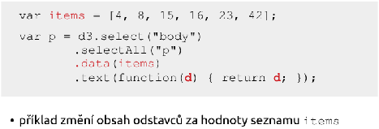
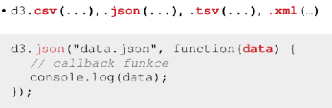
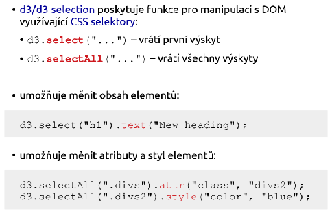

# Canvas, SVG, D3 a GeoJSON

**ROI:** 14 bodov = 6 historická frekvencia + 8 recent boost.

**Minimum:** Rozdiel Canvas/SVG, D3 selekcie, GeoJSON typy a knižnice.

## Must Know subpages

- [Canvas, SVG, D3 a GeoJSON](../must-know/canvas-svg-d3) - 3x Canvas/SVG, 2x D3, 1x GeoJSON, plus recent webviz signál

## Skúšková odpoveď

Canvas je rastrové plátno. Prvky po vykreslení nie sú samostatné DOM uzly, preto je vhodný na veľa objektov, hry a animácie, ale horšie sa s ním viažu udalosti na konkrétne tvary.

SVG je XML vektorová grafika. Prvky ako rect, circle, line a path sú v DOM, dajú sa štýlovať cez CSS a obsluhovať cez event handlery. Na diagramy a dátové vizualizácie je zvyčajne vhodnejšie SVG.

D3 transformuje dáta na DOM/SVG elementy. Treba vedieť select/selectAll, data(), enter(), text(), attr() a jednoduché dogenerovanie podľa poľa. GeoJSON je JSON formát pre geografické objekty ako Point, LineString a Polygon; v praxi sa používa s knižnicami ako d3-geo, Leaflet alebo Google Maps API.

## Čo musíš vedieť

- Povedať jednu vetu o Canvas a jednu o SVG.
- Napísať krátky Canvas kód s getContext('2d').
- Napísať krátke SVG s rect alebo circle.
- Napísať D3 selekciu podľa id a doplnenie položiek z poľa.
- Vymenovať rastrové, vektorové a kombinované mapy, GeoJSON typy a aspoň 2 knižnice.

## Recent signály

- Opravný 2024/25: SVG, krátky kód, výhody/nevýhody a Canvas.
- Riadny 2024/25: Canvas, rozdiel od SVG, jeden context prvok a kód.
- Riadny 2024/25: D3, selekcia podľa id, nahradenie v 
 a dogenerovanie zo zoznamu.
- Finálny zoznam: Canvas, D3js.
- Riadny 2025/2026: GeoJSON - čo to je, typy/štruktúry, použitie a JS knižnice.

## Staré otázky a odpovede

### 3x Canvas a SVG, popsat, uvest jak se vztahuji k DOM a pro vykresleni diagramu.
Frekvencia v zdroji: **3x**.
**Canvas**  
umožňuje renderovat grafické prvky ve formě rastrové grafiky  
vhodné pro náročnější grafiku nebo při tvorbě her  
\<canvas\> je obdélníková oblast určující:

* výšku  
* šířku  
* identifikátor v rámci dokumentu (id)

Prvky nejsou reprezentovány v DOM (=\> obtížnější přístup, manipulace, provázání s uživatelskými eventy)  
Pro tvorbu diagramů je lepší SVG  
Pro úpravu obsahu je potřeba použít Canvas API  
Metody pro kreslení poskytuje objekt získaný metodou getContext()  
   
**SVG**  
značkovací jazyk rodiny XML pro popis vektorové grafiky  
není vhodné pro náročnější grafiku  
\<svg\> je obdélníková oblast určující:

* šířku  
* výšku  
* v těle popis vektorových elementů  
* případně identifikátor v rámci dokumentu (id)

Lze vložit přímo do HTML =\> Prvky jsou reprezentovány v DOM  
Nutnost dynamicky generovat svg elementy na základě dat  
Elementům je možné nastavit handlery událostí (onclick, mouseover, ...)  
Základní elementy: \<rect\>, \<circle\>, \<line\>, \<path\>, ...  
Styly lze nastavit buď inline nebo za použití externího CSS - fill, stroke, ...

---

### 2x D3.js popsat, co ma na vstupu/vystupu. Uveden seznam items \= \[15,312,24124...\] a bylo potreba napsat prikaz ktery ziska nejaky seznam a nahradi jeho hodnoty s hodnotami v seznamu items.
Frekvencia v zdroji: **2x**.
D3.js - knihovna jazyka Javascript určená pro manipulaci s dokumenty na základě dat  
**Vstup:** data (csv, json, xml, …)  
**Výstup:** dokument (elementy DOM)

**Seznam items (tohle je tip):**  

**Pro rozšíření:**  
****  

---

### 1x Typy geografickych grafu / vizualizace geografických dat, co je GeoJSON a použití
Frekvencia v zdroji: **1x**.
**Řešení:**

**Typy**

* **rastrové** - obrázky reprezentující reálnou mapu (*tiles*) - odpovídají aktuálnímu přiblížení, pozici (např. OpenStreetMap, Google Maps, Mapy.cz)  
* **vektorové** - polygony (státy), cesty (řeky), body (místa na mapě)  
* **kombinované** (nejpoužívanější) - rastrový podklad + vektorové překrývající se objekty (*overlays*)

**GeoJSON**

Formát pro kódování geografických dat (standardizovaný). Popisuje body, čáry, polygony atd. Hodnoty reprezentují zeměpisné souřadnice. Použití například pro reprezentaci státních hranic. Příklad:

**Dostupné knihovny**

D3 Kartogram, Leaflet, Google Maps API, Mapy.cz API

## Poznámky z prípravy

## P9 Vizualizácia dát

### Webová vizualizácia dát

#### Canvas

Canvas (v preklade „plátno“) je element HTML5, ktorý umožňuje dynamické vykresľovanie **rastrovej grafiky** pomocou skriptovacieho jazyka, zvyčajne JavaScriptu.

* **Charakteristika:**  
  * Ide o **rastrový prístup**, kde sa grafika vykresľuje pixel po pixeli.  
  * Grafické prvky (napr. nakreslený obdĺžnik) **nie sú reprezentované v DOM** (Document Object Model), čo znamená, že prehliadač o nich po vykreslení „nevie“ ako o samostatných objektoch.  
  * Obsah sa definuje cez **Canvas API** získaním kontextu, najčastejšie 2D (`getContext("2d")`) pre bežnú grafiku alebo WebGL pre pokročilú 3D grafiku a hry.  
* **Silné stránky:**  
  * Vysoký výkon pri spracovaní **veľkého množstva grafických prvkov**.  
  * Ideálny na tvorbu hier a komplexných animácií.  
* **Slabé stránky:**  
  * **Sťažený prístup a manipulácia** s jednotlivými prvkami po ich vykreslení.  
  * Horšie prepojenie s používateľskými udalosťami (napr. kliknutie na konkrétny stĺpec v grafe).

#### SVG (Scalable Vector Graphics)

SVG je značkovací jazyk z rodiny XML určený na popis **vektorovej grafiky**, ktorý je štandardom W3C.

* **Charakteristika:**  
  * Ide o **vektorový prístup**, čo znamená, že grafika zostáva ostrá aj pri priblížení.  
  * Všetky grafické prvky (ako `<circle>`, `<rect>` alebo `<path>`) **sú súčasťou DOM**, takže sa s nimi dá pracovať podobne ako s bežnými HTML elementmi.  
  * Podporuje štýlovanie pomocou **CSS** a priraďovanie handlerov pre **udalosti** (napr. `onclick`, `onmouseover`) priamo k jednotlivým tvarom.  
* **Silné stránky:**  
  * **Jednoduchý prístup a manipulácia** s prvkami pomocou JavaScriptu alebo knižníc ako **D3.js**.  
  * Vstavaná podpora pre animácie a interaktivitu.  
  * Najvhodnejšia voľba pre tvorbu **vizualizačných nástrojov a diagramov**.  
* **Slabé stránky:**  
  * Pri extrémne vysokom počte objektov (tisíce prvkov v DOM) klesá výkon vykresľovania.

### D3.js (Data-Driven Documents)

D3.js je JavaScriptová knižnica určená na **manipuláciu s dokumentmi na základe dát**. Funguje na princípe transformácie vstupných dát (napr. CSV, JSON) na vizuálne elementy DOM.

* **Základné funkcie a manipulácia s DOM:**  
  * **Selekcia:** Pomocou funkcií `d3.select()` (prvý výskyt) a `d3.selectAll()` (všetky výskyty) možno vyberať elementy pomocou CSS selektorov a následne meniť ich text, atribúty alebo štýly.  
  * **Práca s dátami:** Funkcia `data()` prepojí dáta s vybranými elementmi. Kľúčové sú funkcie **enter()** (vytvorenie uzlov pre nové dáta) a **exit()** (odstránenie prebytočných uzlov).  
  * **Dynamické vlastnosti:** Atribúty elementov (napr. farbu alebo výšku) možno nastavovať dynamicky pomocou anonymných funkcií, ktoré pracujú s hodnotou dát (`d`) a ich indexom (`i`).  
  * **Animácie a udalosti:** Podporuje plynulé prechody cez `transition()`, nastavenie trvania (`duration`) a odozvu na udalosti ako `onclick` alebo `onmouseover`.  
* **Štruktúra projektov:** D3 sa skladá z viacerých modulov, napríklad **d3-shape** (tvary), **d3-scale** (projekcia dát), **d3-transition** (animácie) alebo **d3-geo** pre mapy.

### Geovizualizácia

Cieľom geovizualizácie je zobraziť dáta priradené ku konkrétnym geografickým súradniciam (**zemepisná šírka a dĺžka**) priamo na mape.

* **Spôsoby reprezentácie mapy:**  
  * **Rastrová:** Mapa sa skladá z obrázkových dlaždíc (**tiles**), ktoré zodpovedajú aktuálnej pozícii a priblíženiu (napr. OpenStreetMaps).  
  * **Vektorová:** Mapa je definovaná pomocou geometrických tvarov – **polygóny** (štáty), **čiary** (rieky) alebo **body** (mesta).  
  * **Kombinovaná:** Využíva rastrový podklad, nad ktorým sú vykreslené vektorové vrstvy (tzv. **overlays**).  
* **Dátový formát GeoJSON:**  
  * Ide o štandardizovaný formát (RFC 7946) na kódovanie geografických dát v štruktúre JSON.  
  * Popisuje objekty ako `Point` (bod), `LineString` (čiara) a `Polygon`.  
  * Súradnice v GeoJSONe reprezentujú reálne miesta na Zemi.  
* **Nástroje pre geovizualizáciu:**  
  * **d3-geo:** Modul pre D3.js, ktorý poskytuje funkcie pre rôzne **mapové projekcie** (napr. azimutálna, kužeľová, cylindrická) a spracovanie GeoJSON súborov na tvorbu **kartogramov**.  
  * **Leaflet:** Responzívna open-source knižnica na tvorbu komplexných máp. Umožňuje skladať mapy z dlaždíc (tiles), pridávať značky (markers) a vyskakovacie okná (popups).  
  * **Google Maps Platform:** Robustné riešenie vyžadujúce API kľúč, ktoré takisto umožňuje prácu s vrstvami a značkami na mapách Google.

