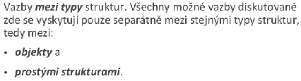
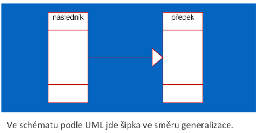
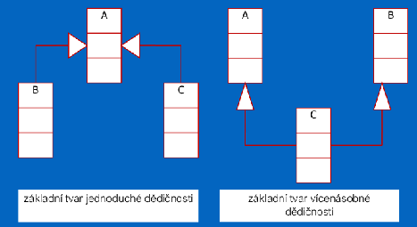

# Objektový Model, Dedičnosť a Vícetypovosť

**ROI:** 2 bodov = 2 historická frekvencia + 0 recent boost.

**Minimum:** Jednoduchá/vícenásobná dedičnosť, extent, roly.

## Skúšková odpoveď

Dedičnosť definuje nový typ ako rozdiel oproti predkovi. Následník je kompatibilný s predkom, ale nie opačne. Extent typu je množina jeho inštancií a extent predka zahŕňa aj inštancie následníkov.

Jednoduchá dedičnosť má jedného priameho predka a tvorí strom. Vícenásobná dedičnosť môže mať viac predkov a tvorí acyklický graf. Cyklus v grafe dedičnosti nesmie vzniknúť.

Vícetypovosť rieši, že persistentný objekt môže v čase niesť rôzne kombinácie rolí, napríklad osoba môže byť študent, čitateľ aj zamestnanec. Problémom sú nedovolené kombinácie rolí, ktoré sa riešia pravidlami súčasnej alebo výlučnej existencie.

## Čo musíš vedieť

- Definovať jednoduchú a vícenásobnú dedičnosť.
- Nakresliť strom a acyklický graf.
- Vysvetliť typovú kompatibilitu následník -> predok.
- Definovať extent.
- Vysvetliť vícetypovosť na osobe s rolami.

## Recent signály

- V súbore `PIS-zbytok.md` nie je priama zmienka.

## Staré otázky a odpovede

### 1x dedicnost v objektovem modelu. definice jednoduche a vicenasobne dedicnosti \+ jejich grafy.
Frekvencia v zdroji: **1x**.
****  
****

* U **jednoduché dědičnosti** každý následník smí mít pouze jediného předka. V grafické podobě dědičnosti to znamená, že ze žádného typu nesmí vycházet více, nežli jedna šipka. Takto zakreslený graf je potom stromem.  
* U **vícenásobné dědičnosti** není počet předků omezen. V grafické podobě dědičnosti to znamená, že z každého typu smí vycházet libovolný počet šipek. Takto zakreslený graf je obecný acyklický graf.

---

### 1x Vícetypovost \- k čemu je potřeba, jaký je s ní spojen problém, jak se řeší, uvést příklad
Frekvencia v zdroji: **1x**.
vícetypovost je vícenásobná dědičnost (škaredé, fuj) pro persistentní objekty prováděná v čase běhu  
role: změna role objektu v čase u perzistentních objektů

Pokud objektem modelujeme jistou realnou skutecnost, je predpoklad existence jedineho  
koncoveho typu je nedostatecna. Pokud modelujeme Osobu, tak muze mit vice roli, muze  
byt student, muze byt ctenar ve knihovne …

V db aplikacich jsou objekty persistentni a neni mozne predem predpokladat jejich vsechny  
mozne koncove typy. Napr clovek jak bude rust, tak bude zakem, studentem, pracujicim,  
duchodcem … ruzne role. Navic lze vselijak kombinovat. Je tedy nutne umoznit vytvareni  
rychznych kombinaci koncovych typu v jedinem objektu behem jeho existence. A to je  
prave ta vicetypovost.

*Problemy?*  
Problém kolize: zamezení výskytu nedovolených kombinací mohou zajistit relace současné a výlučné existence místo relace dědičnosti.

## Poznámky z prípravy

## P3 Objektový model dát

**Dedičnosť (Dědičnost)**

* **Princíp:** Definovanie nového typu (následníka) pomocou rozdielov (diferencií) oproti existujúcemu typu (predkovi).  
* **Tri druhy diferencií:**  
  * **Pridávanie** novej vlastnosti.  
  * **Modifikácia** (upresnenie) existujúcej vlastnosti.  
  * **Zrušenie** (vypustenie) vlastnosti.  
* **Hierarchia:**  
  * **Predok vs. Následník:** Typ, z ktorého sa dedí, je predok; odvodený typ je následník.  
  * **Jednoduchá dedičnosť:** Následník má iba jedného priameho predka (grafom je strom).  
  * **Vícenásobná dedičnosť:** Následník môže mať viacero priamych predkov (obecný acyklický graf).  
  * **Pravidlo cyklu:** V grafe dedičnosti sa nesmie vyskytovať cyklus – žiaden typ nemôže byť svojím vlastným predkom.

**Typová kompatibilita a Extent**

* **Kompatibilita:** Každá štruktúra určitého typu je zároveň typu všetkých svojich predkov. Následník je kompatibilný s predkom (napr. všade, kde sa očakáva "Osoba", môže vystupovať "Študent"), ale nie naopak.  
* **Extent:** Kolekcia všetkých existujúcich inštancií daného typu v databáze.  
  * Extent predka obsahuje aj všetky inštancie jeho následníkov.

**Abstraktné a konkrétne typy**

* **Abstraktné typy:** Slúžia len ako vzory (stavebné kamene) pre následníkov a nemôžu mať vlastné inštancie (napr. "Ekonomický subjekt").  
* **Konkrétne typy:** Typy, ktoré reálne vytvárajú inštancie/objekty (napr. "Banka").

