# Workflow a WfMC

**ROI:** 20 bodov = 15 historická frekvencia + 5 recent boost.

**Minimum:** Definície, WfMC model, AND/XOR/OR brány.

## Must Know subpages

- [Workflow pojmy a súvislosti](../must-know/workflow-pojmy) - 8x historicky, plus recent workflow signál
- [WfMC referenčný model](../must-know/wfmc-referencny-model) - 4x historicky, plus recent workflow otázky
- [Workflow dáta, aplikácie a brány](../must-know/workflow-data-brany) - 2x dáta/aplikácie, 1x AND/XOR, recent AND/OR split/join

## Skúšková odpoveď

Workflow je technická automatizácia business procesu: riadi poradie aktivít, priraďuje ich zdrojom a vytvára pracovné položky pre konkrétne prípady. Na skúške treba vedieť najmä 3D pohľad: prípad, proces/úloha a zdroj/aktivita.

WfMC referenčný model má v strede WES, ktorý obsahuje jeden alebo viac workflow enginov. Okolo neho je päť rozhraní: nástroje definície procesu, workflow klienti, vyvolané aplikácie, iné WES systémy a administrácia/monitoring.

Pri bránach kresli jednoduchý tok: AND-split spustí všetky vetvy, AND-join čaká na všetky, XOR-split vyberie jednu vetvu, XOR-merge pokračuje po prvej prichádzajúcej vetve. OR-split aktivuje jednu alebo viac vetiev a OR-join čaká len na tie, ktoré sa skutočne spustili.

## Čo musíš vedieť

- Definovať proces, prípad, úlohu, zdroj, pracovnú položku a aktivitu.
- Nakresliť WfMC referenčný model a pomenovať 5 rozhraní.
- Rozlíšiť klientske a vyvolané aplikácie.
- Rozlíšiť riadiace, vecné a aplikačné dáta.
- Nakresliť AND, XOR a OR vetvenie/spájanie.

## Recent signály

- Opravný 2024/25: Workflow ako riadny termín, ale OR-split.
- Riadny 2024/25: Workflow, definícia návrhárom, zobrazenie, AND-split nakresliť a popísať.
- Finálny zoznam: Workflow - riadne procesu.
- Riadny 2025/2026: Workflow - čo to je, ako sa popisuje a AND split/join.

## Staré otázky a odpovede

### 15x WF – 8x  Definujte pojmy proces, uloha, pripad, zdroj, pracovna polozka, aktivita. Uvedte ako spolu suvisia.
Frekvencia v zdroji: **8x**.
• proces

• koordinační mechanismus napříč organizačními jednotkami distribuovaný v čase a prostoru

• integruje a koordinuje distribuované zdroje a poskytuje správnou informaci správnému jednotlivci ve správný čas k vykonání přiděleného úkolu

• případ (case)

• konkrétní řešený problém (žádost o půjčku)

• úloha (task) 

• krok provádění procesu

• zdroj (resource) 

• zařízení (fax, tiskárna) nebo osoba (účastník, dělník, zaměstnanec)

• pracovní položka, požadavek (work item)   
• úkol řešený pro konkrétní případ, např. „vrátit panu Novákovi peníze za reklamované zboží“

• činnost (activity)   
• úkol řešený pro konkrétní případ a využívající konkrétní zdroj   
• vytváří frontu požadavků (worklist)

 

Jak to spolu souvisí? - Určují nám pohled na workflow a taky jej reprezentují.  
**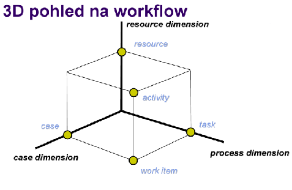**

---

### 15x WF \- 4x \- Schema referencneho modelu. Nakreslit schemu, popisat prvky a rozhrania (strucne).
Frekvencia v zdroji: **4x**.
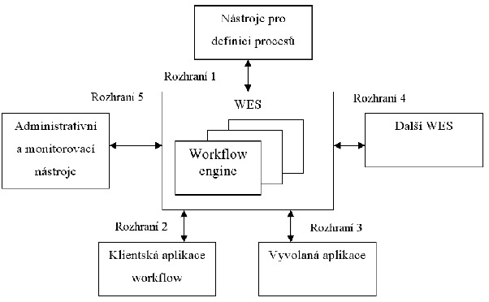

 

**WES (workflow enactment service)**:

* Zajišťuje vykonání správné činnosti pomocí správného prostředku ve správný čas  
* Sklada se z jednoho nebo více workflow engines

**Workflow engine**:

* Interpretace definice procesu  
* Vytváří instance procesů a řídí jejich vykonávání  
* Zajišťuje přechody mezi aktivitami a vytváření pracovních položek

**Klientské aplikace workflow**:

* Provádí jednotlivé úkoly  
* Interakce uživatelů s workflow

**Vyvolané aplikace**:

* Spouštěné v souvislosti se započetím úkolu apod.

**Nástroje pro definici procesů**:

* Umožňují definici a rozplánování procesů na počítači

 

**ROZHRANÍ**

1. Pro nástroje pro definici procesů   
2. Pro workflow klienty   
3. Pro volané aplikace   
4. Pro komunikaci s jinými WFM systémy  
5. Pro administraci a monitorování

Data WF: 

• Model organizační struktury – Role, vztahy nadřízený – podřízený 

• Definice procesu – Činnosti, přidělení rolím, rozhodovací pravidla 

• Seznam úkolů – Aktuální úkoly pro konkrétní uživatele – Uživateli buď skryt (postupné přidělování úkolů) nebo přístupný (uživatel si volí pořadí, možno i více úkolů současně) 

• Řídicí data workflow – Interní data WF systému nutná pro zajištění chodu příp. zotavení po havárii – Nedostupná externím aplikacím 

• Věcná data workflow – Zpracování jádrem workflow systému – Používána pro rozhodování o dalším postupu – Dostupná i aplikacím 

• Aplikační data workflow – Specifická data aplikací podporujících proces – Nejsou přístupná WF systému

---

### 15x WF \- 2x Popiste klientske a vyvolane aplikacie vo WF. Popiste aplikacne, vecne, riadace data vo WF.
Frekvencia v zdroji: **2x**.
Procedurální automatizace business procesu prostřednictvím správy sekvence pracovních aktivit a vyvolání příslušných lidských nebo IT zdrojů příslušejících k těmto aktivitám.

**Klientské aplikace workflow**:

* Provádí jednotlivé úkoly  
* Interakce uživatelů s workflow

**Vyvolané aplikace**:

* Spouštěné v souvislosti se započetím úkolu - automatizovane apod.  
* Su to aplikace 3tich stran. Word, Učtovnicka aplikace apod.

• Řídicí data workflow – Interní data WF systému nutná pro zajištění chodu příp. zotavení po havárii – Nedostupná externím aplikacím 

• Věcná data workflow – Zpracování jádrem workflow systému – Používána pro rozhodování o dalším postupu – Dostupná i aplikacím 

• Aplikační data workflow – Specifická data aplikací podporujících proces – Nejsou přístupná WF systému

---

### 15x WF \- 1x  Nakreslete a popište co dělají jednotlivé prvky řízení toku ve workflow: AND-split, AND-join, XOR-split, XOR-merge
Frekvencia v zdroji: **1x**.
**Parallel split (AND - split)** 

*  Rozděluje tok procesů (workflow) do dvou a více paralelních vláken

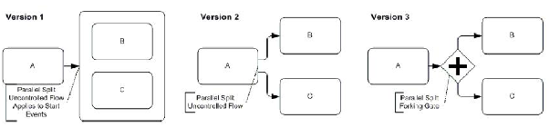

**Synchronizace (AND - join)** 

* Dalším úkolem se pokračuje, až po dokončení  všech předchozích vláken.

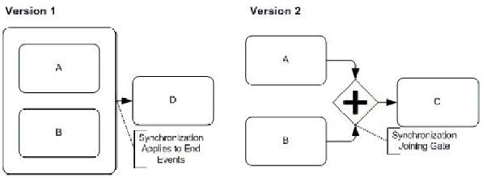  
**Výlučné rozhodnutí (XOR - split)**

* Rozděluje tok procesů na dvě nebo více větví,  které jsou vzájemně výlučné. Podle podmínky v Gateway se vstupuje do jedné z větví.

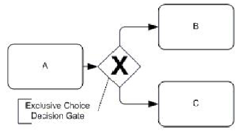

**Jednoduché spojení (XOR - merge)**

* Spojení dvou nebo více nezávislých větví do  jedné. Navazující aktivita začne okamžitě, jakmile jedno vlákno dosáhne svého konce.

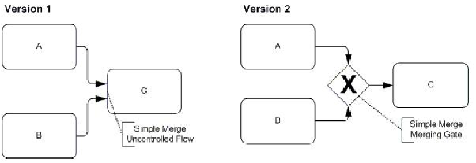

## Poznámky z prípravy

## P7 Workflow

*(asi až zbytočne veľa naslopovaných poznámok o tejto téme nakoľko sa o toto prebralo za menej ako hodinu)*

### Podnikové (business) procesy

* Slúžia ako **koordinačný mechanizmus** naprieč organizačnými jednotkami, distribuovaný v čase a priestore.  
* Integrujú a koordinujú distribuované zdroje.  
* Zabezpečujú doručenie **správnej informácie správnemu človeku v správny čas** (odpovedajú na otázky: ČO, AKO, KEDY a KTO).  
* Z hľadiska technológie ide o **popis procesov mimo vlastnej implementácie IS** a o infraštruktúru schopnú tieto popisy vykonať.

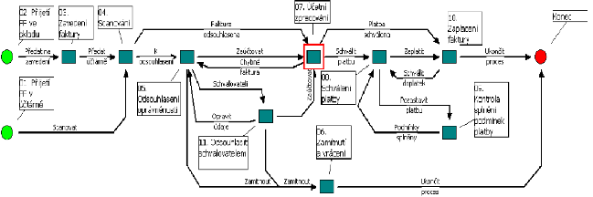

### Workflow a jeho vzťah k procesom

* **Definícia:** Ide o **procedurálnu automatizáciu** business procesu, ktorá spravuje sekvenciu aktivít a vyvoláva príslušné zdroje.  
* **Rozdiel medzi business procesom a workflow:**  
  * **Business proces:** Obecnejší pohľad z organizačnej perspektívy.  
  * **Workflow:** Konkrétny popis technickej realizácie a implementácie procesu.

**Prechod od front k workflow**

* **Zotaviteľné fronty:** Tvoria základ pre sekvenovanie; zaručujú len to, že po dokončení akcie A sa niekedy vykoná akcia B.  
* **Workflow pridáva navyše:**  
  * **Jazyk na popis procesov:** Formálna definícia aktivít, podmienok a vetvenia.  
  * **Roly a swimlanes:** Priradenie aktivít konkrétnym účastníkom.  
  * **Smerovanie:** Využitie logických brán (XOR/AND/OR) namiesto ručne programovanej logiky.  
  * **Monitoring a analýza:** Sledovanie stavu inštancií a výkonnostných metrík.

#### Štandardizácia a WfMC

* **WfMC (Workflow Management Coalition):** Medzinárodná nezisková organizácia (založená v roku 1993), ktorá vznikla kvôli potrebe integrácie veľkého množstva softvérových nástrojov pre workflow.  
* **Oblasti štandardizácie:**  
  * Jednotná terminológia a **referenčný model**.  
  * Spolupráca a prepojenie rôznych WF systémov.  
  * Formáty pre výmenu definícií procesov (od XPDL k súčasnému **BPMN 2.0 XML**).

**Referenčný model WfMC**  
Model definuje centrálne rozhranie **WES**, na ktoré sa cez päť špecifických rozhraní pripájajú ostatné komponenty systému:

1. **Rozhranie 1:** Nástroje pre definíciu procesov.  
2. **Rozhranie 2:** Klientske aplikácie workflow.  
3. **Rozhranie 3:** Vyvolané aplikácie.  
4. **Rozhranie 4:** Iné systémy WES.  
5. **Rozhranie 5:** Administratívne a monitorovacie nástroje.

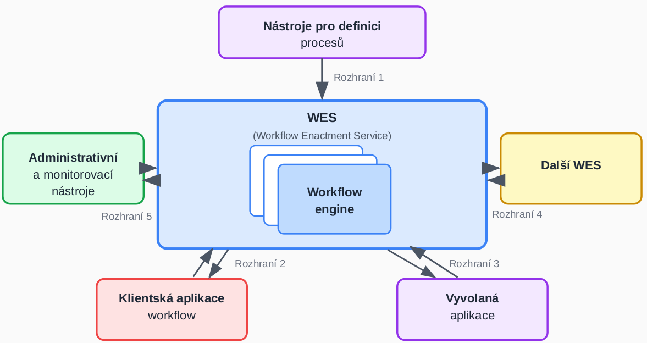

#### WES a Workflow Engine

* **WES (Workflow Enactment Service):** Služba, ktorá zabezpečuje vykonanie správnej činnosti pomocou správneho prostriedku v správny čas; skladá sa z jedného alebo viacerých workflow enginov.  
* **Workflow Engine:** Jadro systému, ktoré:  
  * Interpretuje formálnu definíciu procesu.  
  * Vytvára inštancie procesov a riadi ich priebeh.  
  * Zabezpečuje prechody medzi aktivitami a vytvára pracovné položky (work items).  
  * Umožňuje administráciu a dohľad nad procesmi.

**Hlavné prvky WF systému**

* **Klientske aplikácie:** Rozhrania pre používateľov, ktorí cez ne vykonávajú jednotlivé úlohy.  
* **Vyvolané aplikácie:** Softvérové nástroje spúšťané automaticky systémom pri začatí úlohy.  
* **Nástroje pre definíciu:** Grafické editory (typicky **BPMN**) na modelovanie správ, udalostí a rozhodovacích pravidiel.  
* **Nástroje pre analýzu a verifikáciu:**  
  * **Simulácia:** Overovanie modelu a predikcia správania („čo sa stane, keď...?“).  
  * **Verifikácia:** Matematické metódy (napr. **Petriho siete**) na overenie, či proces vždy dôjde do cieľa.  
* **Administrácia a monitorovanie:** Sledovanie stavu inštancií v reálnom čase, kontrola lehôt (**SLA**) a meranie výkonnosti.

#### 3D pohľad na workflow (dimenzie)

Model workflow možno vnímať cez tri základné osi, ktoré definujú jeho fungovanie:

* **Case dimension (Prípad):** Predstavuje konkrétny riešený problém (napr. konkrétna „žiadosť o pôžičku“), ktorý zvyčajne generuje externý zákazník. Spracúva sa vykonávaním úloh v určenom poradí.  
* **Process dimension (Proces):** Definuje **úlohu (task)** ako krok vykonávania procesu, ktorý je charakterizovaný podmienkami pred (precondition) a po (postcondition) jeho vykonaní.  
* **Resource dimension (Zdroj):** Zahŕňa zariadenia alebo osoby (zdroje), ktoré prácu vykonávajú.  
  * **Pracovná položka (work item):** Úloha pre konkrétny prípad.  
  * **Činnosť (activity):** Spojenie úlohy s konkrétnym zdrojom, ktoré vytvára front (worklist).

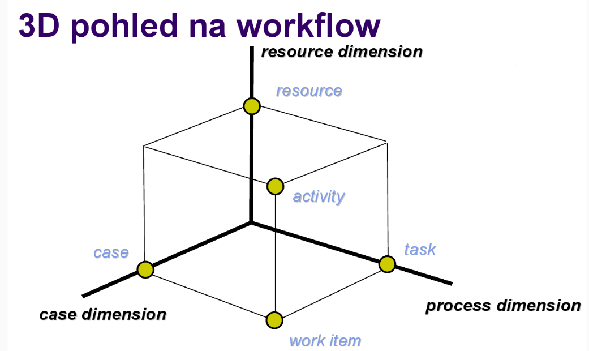

#### Role a dáta vo workflow

Prácu vo workflow nevykonávajú pracovníci náhodne, ale na základe priradených kompetencií a údajov:

* **Role:** Predstavujú triedu zdrojov podľa schopností (napr. „programátori“). Jedna osoba môže mať viacero rolí a mnoho osôb môže zdieľať rovnakú rolu. Role sú autorizované spracovávať požiadavky z front prislúchajúcich k činnostiam.  
* **Typy dát vo workflow:**  
  * **Riadiace dáta:** Interné údaje workflow systému, ktoré sú navonok nedostupné.  
  * **Vecné dáta:** Slúžia na rozhodovanie v rámci procesu a sú prístupné aj aplikáciám.  
  * **Aplikačné dáta:** Dáta špecifické pre konkrétne aplikácie, ku ktorým workflow systém nemá prístup.  
* **Organizačný model:** Definuje role a vzťahy medzi nadriadenými a podriadenými.  
* **Zoznam úloh (Worklist):** Aktuálne úlohy pre používateľa, ktoré môžu byť pridelené postupne (skryté) alebo si ich používateľ volí sám.

#### Životný cyklus workflow

Životný cyklus workflow pozostáva z piatich nadväzujúcich fáz:

1. **Definícia procesu:** Modelovanie procesu v grafickom editore (najčastejšie pomocou štandardu **BPMN**).  
2. **Nasadenie (Deployment):** Prenos hotovej definície procesu do workflow enginu.  
3. **Spustenie inštancií:** Vytváranie a riadenie konkrétnych bežiacich prípadov (instancií).  
4. **Monitorovanie:** Sledovanie stavu inštancií, dodržiavania lehôt (**SLA**) a využitia zdrojov.  
5. **Analýza a optimalizácia:** Identifikácia úzkych miest v procese a následná úprava modelu pre zvýšenie efektivity.

### Ciele Business Process Managementu (BPM)

* **Formálny popis:** Snaha o presné zachytenie procesov prebiehajúcich v rámci organizácie.  
* **Riadenie:** Využitie popísaných modelov na riadenie reálneho chodu pomocou **WFM systémov**.  
* **Zvyšovanie efektivity:** Možnosť následnej analýzy a verifikácie procesov.

#### Štandardy pre modelovanie

* **BPMN 2.0 (Business Process Model and Notation):** Aktuálny primárny štandard, ktorý kombinuje grafickú notáciu s natívnou **XML serializáciou** (BPMN XML). Definície sú priamo spustiteľné v BPMN enginoch (napr. Camunda, Flowable).  
* **Historické formáty (legacy):**  
  * **XPDL:** Pôvodný deskriptívny formát WfMC.  
  * **BPEL (WS-BPEL):** Procedurálny jazyk orientovaný na webové služby.

**Základné elementy BPMN**  
BPMN využíva špecifické kategórie objektov na vizualizáciu toku procesu:

* **1\. Události (Events):** Ovplyvňujú tok procesu (začiatok, koniec, zmena stavu).  
  * **Start (tenký okraj):** None, časovač, správa, signál.  
  * **Mezilehlá (dvojitý okraj):** Časovač, správa, chyba, eskalácia.  
  * **Konec (silný okraj):** None, správa, chyba, ukončenie (terminate).  
  * **Boundary (hraničné):** Prichytené k aktivite; môžu byť **prerušujúce** (zastavia aktivitu) alebo **neprerušujúce** (spustia paralelný tok).  
* **2\. Aktivity (Activities):** Práca, ktorá sa má vykonať; zahŕňa atomické **úlohy (tasks)**, podprocesy alebo opakujúce sa úlohy.  
* **3\. Brány (Gateways):** Riadia vetvenie a slučovanie toku.  
  * **XOR (výlučné):** Práve jedna vetva.  
  * **AND (paralelné):** Všetky vetvy súčasne.  
  * **OR (inkluzívne):** Jedna alebo viacero vetiev.  
* **4\. Spojovacie objekty:**  
  * **Sekvenčný tok (plná šipka):** Určuje poradie aktivít.  
  * **Tok správ (přerušovaná šipka):** Komunikácia medzi rôznymi účastníkmi (poolmi).  
  * **Asociácia:** Prepojenie objektov s textovými poznámkami alebo artefaktmi.

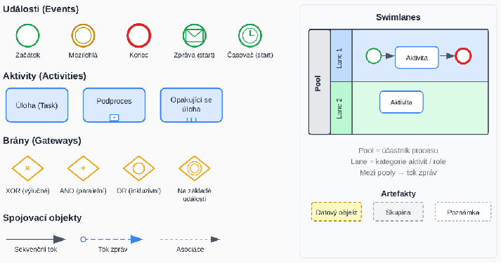

**Plavecké dráhy (Swimlanes)**

* **Pool:** Reprezentuje celého účastníka procesu (napr. organizáciu alebo systém).  
* **Lane:** Rozdeľuje pool na kategórie, ktoré zvyčajne zodpovedajú konkrétnym **rolám alebo oddeleniam**.

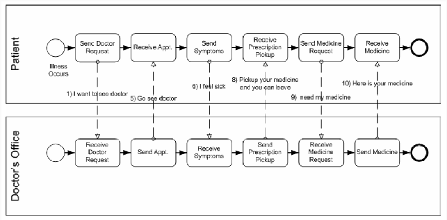

**Kompenzácia v BPMN**

* BPMN 2.0 obsahuje vstavanú podporu pre logické „vrátenie“ efektu dokončenej aktivity (napr. vrátenie platby, ak zlyhalo odoslanie tovaru).  
* Využíva sa na to **kompenzačná úloha** spúšťaná špeciálnou kompenzačnou udalosťou.

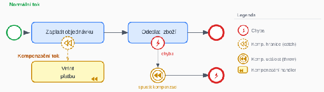

**Vrstvy modelovania procesov**

1. **Vrstva 1 – BPMN notácia:** Grafické diagramy vytvorené v nástrojoch ako Camunda Modeler alebo draw.io.  
2. **Vrstva 2 – BPMN 2.0 XML:** Prenositeľná strojová reprezentácia procesu určená na nasadenie (deploy).  
3. **Vrstva 3 – BPMN engine:** Softvérové jadro, ktoré interpretuje XML a riadi bežiace inštancie (napr. Camunda, Kogito).

#### Workflow Patterns (Vzory riadenia toku)

Tieto vzory slúžia na definovanie logiky smerovania v procese bez nutnosti ručného programovania. Medzi základné patria:

* **Sekvencia (Sequence):** Najzákladnejší vzor; úloha sa spustí až po dokončení predchádzajúcej.  
* **Paralelné vetvenie a synchronizácia (AND):**  
  * **Parallel Split (AND-split):** Rozdelí tok do viacerých paralelných vlákien spustených súčasne.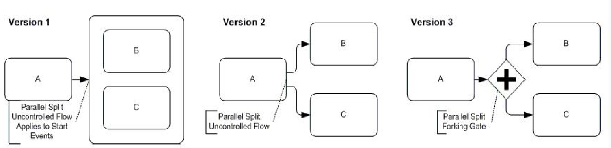  
  * **Synchronizácia (AND-join):** Čaká na dokončenie všetkých paralelných vlákien, kým povolí ďalší krok.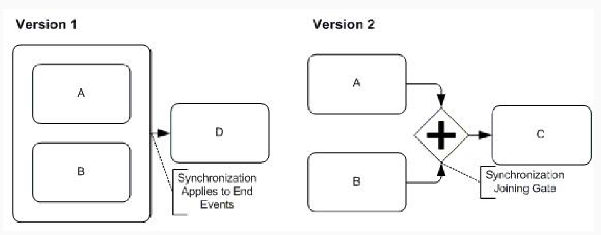  
* **Výlučné rozhodnutie a jednoduché spojenie (XOR):**  
  * **Výlučné rozhodnutí (XOR-split):** Na základe podmienky sa vyberie práve jedna vetva.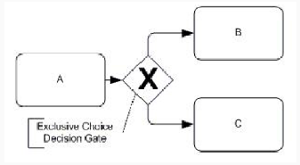  
  * **Jednoduché spojení (XOR-merge):** Spojí nezávislé vetvy; proces pokračuje okamžite, keď ľubovoľná vetva dosiahne bod spojenia (nečaká sa na ostatné).  
* **Vícenásobná volba a synchronizujúce zlúčenie (OR):**  
  * **Vícenásobná volba (OR-split):** Aktivuje jednu alebo viacero vetiev podľa podmienok.  
  * **Synchronizující sloučení (OR-join):** Čaká len na tie vetvy, ktoré boli reálne spustené.

#### Flexibilita workflow

Flexibilita je nevyhnutná, pretože podmienky pre chod organizácie sa neustále menia (napr. zmena legislatívy či reštrukturalizácia). Zdroje rozlišujú dva prístupy k jej zabezpečeniu:

1. **Dopredná flexibilita:** Snaha uvažovať o všetkých možných situáciách a variantoch už pri návrhu procesu.  
2. **Zpětná flexibilita (Dynamická evolúcia):** Schopnosť zmeniť definíciu workflow za behu, pričom na realizáciu týchto zmien sa využívajú tzv. **evolution patterns**.

**Správa existujúcich inštancií pri zmene**  
Pri zmene schémy procesu (napr. prechod z verzie 1 na verziu 2) je kľúčové rozhodnúť, čo so starými, rozpracovanými prípadmi:

* **Concurrent to completion:** Najbezpečnejší prístup; staré inštancie dobehnú podľa pôvodného schématu, nové už podľa nového. Nevýhodou je, že v systéme existuje viacero verzií súčasne, čo komplikuje monitoring.  
* **Migrace na finální schéma:** Existujúce inštancie sa okamžite prevedú na nové schéma. Podmienkou je, že inštancia musí byť v **kompatibilnom stave** (napr. nesmie byť v aktivite, ktorá v novej verzii neexistuje).  
* **Migrace na ad-hoc schéma:** Najflexibilnejší, ale najzložitejší spôsob; vytvorí sa dočasné „mostové“ schéma, ktoré prevedie inštanciu zo starého stavu do bodu kompatibilného s novým procesom.

### Moderné technológie a nástroje Workflow

**Moderné BPMN 2.0 enginy**  
Enginy slúžia na interpretáciu a riadenie inštancií procesov definovaných v BPMN XML.

* **Camunda 7:** Najrozšírenejší open-source engine (Java); ponúka REST API, embedded aj standalone režim.  
* **Camunda 8 / Zeebe:** Cloud-native distribuovaný engine; škálovateľný, poskytovaný ako SaaS alebo self-hosted.  
* **Flowable:** Odvodený od Activiti; ľahší engine so silnou integráciou na Spring Boot.  
* **Activiti:** Základ celého ekosystému, spravovaný spoločnosťou Alfresco.  
* **Kogito (Red Hat):** Cloud-native nástupca jBPM určený pre Quarkus a Kubernetes; kombinuje BPMN a DMN.  
* **Bonitasoft:** Low-code platforma s grafickým štúdiom pre tzv. citizen developerov.

#### Moderné prístupy: Orchestrácia vs. Choreografia

Dva odlišné spôsoby koordinácie služieb v rámci procesu:

* **Orchestrácia (centrálna):**  
  * Využíva **centrálny BPMN engine**, ktorý pozná celý stav procesu.  
  * **Výhody:** Centrálnu viditeľnosť, jednoduchšie ladenie a monitoring.  
  * **Nevýhody:** Engine je „single point of failure“ a možný úzke miesto (bottleneck) pri škálovaní.  
* **Choreografia (decentralizovaná):**  
  * **Event-driven** prístup bez centrálneho koordinátora; služby komunikujú cez Message brokera (napr. Kafka).  
  * **Výhody:** Prirodzená škálovateľnosť, voľné väzby medzi službami.  
  * **Nevýhody:** Stav je distribuovaný (ťažšie sledovanie), zložitejšie ladenie a testovanie.

#### Moderné distribuované workflow

* **Temporal (temporal.io):** Prístup „workflow ako kód“ (Java, Python, Go, TypeScript); ponúka automatický retry, timeouty a zotavenie bez straty stavu.  
* **Cloudové managed služby:**  
  * **AWS Step Functions:** Vizuálny stavový stroj (serverless).  
  * **Azure Logic Apps:** Low-code riešenie s rozsiahlym ekosystémom konektorov.  
  * **Google Cloud Workflows:** Definícia cez YAML/JSON pre integráciu GCP služieb.  
  * **Spoločný znak:** Serverless model s platbou za prechody; nevýhodou je vendor lock-in.

#### Process Mining

Automatické objavovanie procesov z **event logov** (záznamy v tvare `[caseID, aktivita, čas]`).

* **Kľúčové úlohy:**  
  * **Discovery:** Rekonštrukcia modelu procesu priamo z logov.  
  * **Conformance checking:** Porovnanie skutočného priebehu v systéme s navrhnutým BPMN modelom.  
  * **Enhancement:** Doplnenie modelu o reálne výkonnostné metriky.  
* **Nástroje:**  
  * **ProM:** Akademická platforma (TU/e).  
  * **Celonis:** Popredné komerčné riešenie.  
  * **Disco / Bupar (Python):** Ľahšie nástroje na analýzu.

